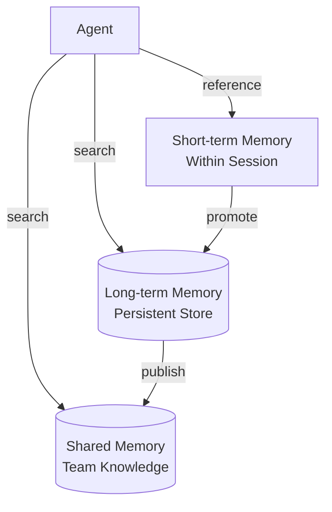

# #23 Layered Memory

!!! abstract "TL;DR"
    Separate agent memory into **short-term, long-term, and shared** layers, explicitly managing scope and lifespan.

<!-- BEGIN:GEN:meta -->

Metadata (machine-readable) — #23 Layered Memory

| Field | Value |
|------|-----|
| **ID** | 23 |
| **Category** | 05-memory-context — Memory & Context Management |
| **Forces** | `[F8]` |
| **Dials** | summarization-timing |
| **Tradeoffs** | in-context-vs-external |
| **Related Patterns** | #24, #25, #26, #12 |
| **When to Use** | Long-running user conversations, multi-agent coordination, personalization needed |
| **When Not to Use** | Stateless single-shot Q&A; layer overhead exceeds benefit |
| **Element Technologies** | Redis TTL, PostgreSQL+pgvector, Pinecone, Weaviate, LLM summarization |

<!-- END:GEN:meta -->

## Overview

During extended chatbot conversations, requirements and preferences communicated early may be "forgotten." This occurs because LLMs have finite context windows and cannot hold all information at once. Layered Memory separates memory into three layers. **Short-term memory** (working memory) holds current session exchanges. **Long-term memory** stores facts and user preferences persisted across sessions. **Shared memory** functions as a knowledge store accessible to multiple agents. Each layer has different write/read policies and individually controlled injection timing into prompts.

!!! info "Position in Decision Framework"
    - **Driving Forces**: `[F8]` Accountability & Regulation
    - **Related Decisions**: [Tuning Dials](../../decisions/tuning-dials.md) — Summarization Timing / [Tradeoffs](../../decisions/tradeoffs.md) — In-context ↔ External State
    - **Decision Flow**: [Decision Flow](../../decisions/decision-flow.md)

## Design

Short-term memory is the session's message history itself, compressed via summarization or sliding window when context window limits are reached. Promotion to long-term memory is controlled by [#25 Memory Write Gate](25-memory-write-gate.md) — writes are not unconditional. Shared memory is implemented as a vector DB or knowledge graph, with access control based on tenant and role.

## Problem Solved

Without layering, either important past decisions get pushed out of the context window and are "forgotten," or everything is crammed in and token costs balloon. Additionally, in multi-agent configurations, "who knows what" becomes opaque, leading to contradictory actions. By defining lifespan, access scope, and write conditions per layer, context utilization efficiency improves while maintaining `[F8]` accountability.

## When to Use / When Not to Use

- **When to Use**: Suitable for long-running user conversations, multi-agent coordination, and business assistants requiring personalization.
- **When Not to Use**: Excessive for stateless single-shot Q&A or use cases where sessions complete in a few turns. Also not suited when layer management overhead outweighs the benefit.

## Element Technologies

- Short-term: In-memory list, Redis (with TTL)
- Long-term: PostgreSQL + pgvector, Pinecone, Weaviate
- Shared: Knowledge graph (Neo4j), shared vector DB
- Summarization: LLM compression summarization, Map-Reduce summarization

## Related Patterns

- [#24 Context Pack / Assembly](24-context-pack-assembly.md) — Retrieves needed memories from each layer and assembles into prompts
- [#25 Memory Write Gate](25-memory-write-gate.md) — Gates long-term memory writes with approval
- [#26 Forgetting and Expiration](26-forgetting-and-expiration.md) — Applies expiration policies to each layer's memories
- [#12 Blackboard](../02-composition/12-blackboard.md) — The blackboard pattern as one form of shared memory
