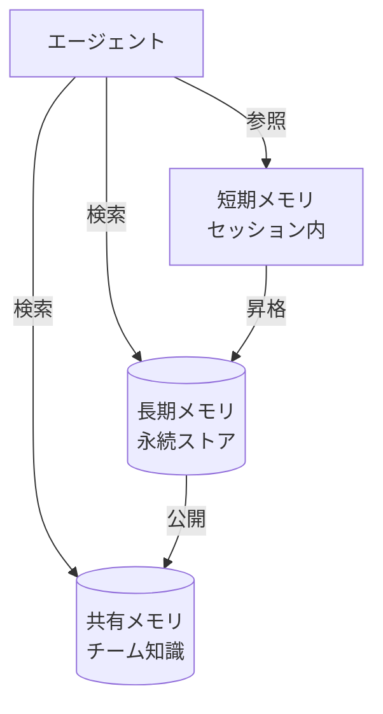

# #23 Layered Memory｜階層化メモリ

!!! abstract "一言"
    エージェントの記憶を**短期・長期・共有**の階層に分け、スコープと寿命を明示的に管理する。

<!-- BEGIN:GEN:meta -->

メタデータ（機械可読） — #23 Layered Memory｜階層化メモリ

| 項目 | 値 |
|------|-----|
| **ID** | 23 |
| **カテゴリ** | 05-memory-context — メモリ・コンテキスト管理 |
| **フォース** | `[F8]` |
| **ダイヤル** | summarization-timing |
| **二者択一** | in-context-vs-external |
| **関連パターン** | #24, #25, #26, #12 |
| **向き** | 長時間ユーザー対話、マルチエージェント協調、パーソナライズが必要 |
| **不向き** | ステートレスな単発Q&A; 階層のオーバーヘッドが利益を超える |
| **要素技術** | Redis TTL, PostgreSQL+pgvector, Pinecone, Weaviate, LLM要約 |

<!-- END:GEN:meta -->

## 概要

チャットボットと長時間やり取りしていると、序盤に伝えた要件や好みを「忘れて」しまうことがある。これはLLMのコンテキストウィンドウに上限があるためで、すべての情報を一度に保持することはできない。Layered Memory は記憶を3つの層に分離する。**短期メモリ**（ワーキングメモリ）は現セッション内のやり取りを保持し、**長期メモリ**はセッションをまたいで永続化されたファクトやユーザー嗜好を格納する。そして**共有メモリ**は、複数エージェント間で参照可能な知識ストアとして機能する。各層は書き込み・読み出しのポリシーが異なり、プロンプトへの注入タイミングも個別に制御される。

!!! info "意思決定上の位置づけ"
    - **必要にするフォース**: `[F8]` 説明責任・規制
    - **関与する決定**: [程度（ダイヤル）](../../decisions/tuning-dials.md) の 要約タイミング / [相反](../../decisions/tradeoffs.md) の 文脈内↔外部状態
    - **意思決定の進め方**: [意思決定の進め方](../../decisions/decision-flow.md)

## 設計

短期メモリはセッションのメッセージ履歴そのものであり、コンテキストウィンドウの上限に達すると要約やスライディングウィンドウで圧縮する。長期メモリへの昇格は [#25 Memory Write Gate](25-memory-write-gate.md) で制御し、無条件には書き込まない。共有メモリはベクトルDB やナレッジグラフとして実装し、テナントやロールに基づいてアクセス制御をかける。

## 解決する課題

階層化しない場合、過去の重要な決定事項がコンテキストウィンドウから押し出されて「忘れてしまう」か、逆にすべてを詰め込んでトークンコストが膨れ上がるかのどちらかになりがちである。また、複数のエージェントが独立に動く構成では「誰が何を知っているか」が不透明になり、矛盾した行動が起きやすくなる。層ごとに寿命・アクセス範囲・書き込み条件を定めることで、説明責任 `[F8]` を維持しつつコンテキストの利用効率を高められる。

## 向き / 不向き

- **向き**: 長期にわたるユーザー対話や、マルチエージェント協調、パーソナライズが必要な業務アシスタントに適している。
- **不向き**: ステートレスな単発Q&Aや、セッションが数ターンで完結する用途には過剰である。階層管理のオーバーヘッドが利点を上回る場合にも向かない。

## 要素技術

- 短期: インメモリリスト、Redis（TTL付き）
- 長期: PostgreSQL + pgvector、Pinecone、Weaviate
- 共有: ナレッジグラフ（Neo4j）、共有ベクトルDB
- 要約: LLMによる圧縮要約、Map-Reduce要約

## 関連パターン

- [#24 Context Pack / Assembly](24-context-pack-assembly.md) — 各層から必要な記憶を取り出しプロンプトへ組み立てる
- [#25 Memory Write Gate](25-memory-write-gate.md) — 長期メモリへの書き込みを承認制にする
- [#26 Forgetting and Expiration](26-forgetting-and-expiration.md) — 各層の記憶に失効ポリシーを適用する
- [#12 Blackboard](../02-composition/12-blackboard.md) — 共有メモリの一形態としての黒板パターン
