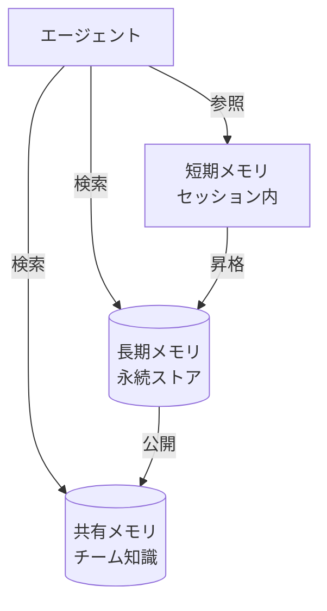

# #23 Layered Memory｜階層化メモリ

!!! abstract "一言"
    エージェントの記憶を**短期・長期・共有**の階層に分け、スコープと寿命を明示的に管理する。

## 概要

LLMのコンテキスト窓は有限であり、すべてを一度に保持できない。Layered Memory は記憶を3層に分離する。**短期メモリ**（ワーキングメモリ）は現セッション内のやり取りを保持し、**長期メモリ**はセッションを跨いで永続化されたファクトやユーザー嗜好を格納し、**共有メモリ**は複数エージェント間で参照可能な知識ストアとして機能する。各層は書き込み・読み出しポリシーが異なり、プロンプトへの注入タイミングも制御される。

## 設計

短期メモリはセッションのメッセージ履歴そのものであり、コンテキスト窓の上限に達すると要約またはスライディングウィンドウで圧縮する。長期メモリへの昇格は [#25 Memory Write Gate](25-memory-write-gate.md) で制御し、無条件に書き込まない。共有メモリはベクトルDB やナレッジグラフとして実装し、テナントやロールでアクセス制御をかける。

## 解決する課題

階層化しない場合、過去の重要な決定事項がコンテキスト窓から押し出されて「忘れる」か、逆にすべてを詰め込んでトークンコストが膨れ上がる。また、複数エージェントが独立に動く構成では「誰が何を知っているか」が不透明になり、矛盾した行動が起きる。層ごとに寿命・アクセス範囲・書き込み条件を定めることで、説明責任 `[F8]` を維持しつつコンテキストの利用効率を高める。

## 向き / 不向き

- **向き**: 長期にわたるユーザー対話、マルチエージェント協調、パーソナライズが必要な業務アシスタント。
- **不向き**: ステートレスな単発Q&A、セッションが数ターンで完結する用途。階層管理のオーバーヘッドが利点を上回る。

## 要素技術

- 短期: インメモリリスト、Redis（TTL付き）
- 長期: PostgreSQL + pgvector、Pinecone、Weaviate
- 共有: ナレッジグラフ（Neo4j）、共有ベクトルDB
- 要約: LLMによる圧縮要約、Map-Reduce要約

## 関連パターン

- [#24 Context Pack / Assembly](24-context-pack-assembly.md) — 各層から必要な記憶を取り出しプロンプトへ組み立てる
- [#25 Memory Write Gate](25-memory-write-gate.md) — 長期メモリへの書き込みを承認制にする
- [#26 Forgetting and Expiration](26-forgetting-and-expiration.md) — 各層の記憶に失効ポリシーを適用する
- [#12 Blackboard](../02-composition/12-blackboard.md) — 共有メモリの一形態としての黒板パターン
