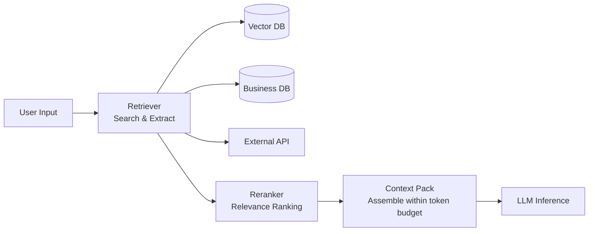

# #24 Context Pack / Assembly

!!! abstract "TL;DR"
    Just before inference, **retrieve, select, and assemble** the necessary context into the prompt, ensuring grounding.

<!-- BEGIN:GEN:meta -->

Metadata (machine-readable) — #24 Context Pack / Assembly

| Field | Value |
|------|-----|
| **ID** | 24 |
| **Category** | 05-memory-context — Memory & Context Management |
| **Forces** | `[F4]`, `[F7]` |
| **Dials** | retrieval-top-k |
| **Tradeoffs** | rag-vs-finetuning |
| **Related Patterns** | #23, #27, #39 |
| **When to Use** | Internal knowledge, support, legal/medical dependency on latest information |
| **When Not to Use** | Model's general knowledge is sufficient; extreme real-time streaming requirements |
| **Element Technologies** | Pinecone, pgvector, Cohere Rerank, HyDE, RecursiveCharacterTextSplitter |

<!-- END:GEN:meta -->

## Overview

When questions concern the latest internal manuals or individual customer contract details, the model's training data alone cannot provide correct answers. To answer accurately using "information the model doesn't know," a mechanism to incorporate the necessary context from external sources is needed. Context Pack refers to the process of retrieving relevant information from multiple sources — long-term memory, external documents, API responses, user history — then selecting and compressing within the token budget to assemble into the prompt. RAG (Retrieval-Augmented Generation) is the most representative implementation, but retrieval sources extend beyond vector DBs to include SQL, APIs, file systems, and more.

!!! info "Position in Decision Framework"
    - **Driving Forces**: `[F4]` Latency Budget, `[F7]` Cost Sensitivity & Scale
    - **Related Decisions**: [Tuning Dials](../../decisions/tuning-dials.md) — Retrieval top-k / Injection volume / [Tradeoffs](../../decisions/tradeoffs.md) — RAG ↔ FT ↔ Long Context
    - **Decision Flow**: [Decision Flow](../../decisions/decision-flow.md)

## Design

The search query can be the user input as-is, or transformed by the LLM (HyDE, query decomposition, etc.). Retrieved chunks are re-ranked by the Reranker for relevance, and excess beyond the token budget is truncated. The assembly order is basically "system instruction → retrieved context → conversation history → user input."

## Problem Solved

The primary purpose is suppressing hallucination when handling latest information, internal information, and individual user information not in the model's training data. Unplanned context window usage causes `[F7]` token cost explosion, and irrelevant information contamination degrades both latency and accuracy `[F4]`. By explicitly designing the assembly process, what was used as the basis for an answer becomes traceable.

## When to Use / When Not to Use

- **When to Use**: Suitable for internal knowledge search, customer support, and legal/medical domains requiring the latest primary information.
- **When Not to Use**: Unnecessary for casual conversation or creative tasks where the model's general knowledge suffices. Also, retrieval latency becomes a bottleneck for stream processing requiring extreme real-time performance.

## Element Technologies

- Vector Search: Pinecone, Weaviate, pgvector, Qdrant
- Reranker: Cohere Rerank, cross-encoder models
- Query Transformation: HyDE, query decomposition, step-back prompting
- Chunk Splitting: RecursiveCharacterTextSplitter, semantic chunking

## Tuning (Dials)

- **Retrieval chunk count (top-k)** — Too few lacks evidence; too many introduces noise and increases cost / Deciding factors: `[F4][F7]` / Guideline: 3–10 items. → [Tuning Dials](../../decisions/tuning-dials.md)
- **Chunk size** — Too small causes context fragmentation; too large dilutes relevance / Guideline: 256–1024 tokens. → [Tuning Dials](../../decisions/tuning-dials.md)

## Related Patterns

- [#23 Layered Memory](23-layered-memory.md) — Provides the memory layers that serve as retrieval targets
- [#27 Evidence-First Answer](../06-reliability/27-evidence-first-answer.md) — Explicitly cites retrieved evidence in answers
- [#39 Prompt Cache Optimized Context](../08-cost-scaling/39-prompt-cache-optimized-context.md) — Improves cache efficiency of assembled context
