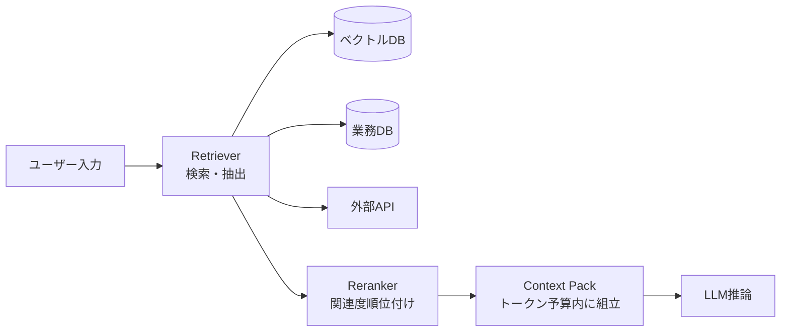

# #24 Context Pack / Assembly｜コンテキスト組立・RAG

!!! abstract "一言"
    推論の直前に、必要な文脈を**検索・選別・組立**してプロンプトへ注入し、グラウンディングを確保する。

## 概要

社内の最新マニュアルや個別顧客の契約内容について質問したとき、モデルの学習データだけでは正しい答えが返ってこない。こうした「モデルが知らない情報」を使って正確に回答するには、外部から必要な文脈を取り込む仕組みが必要になる。Context Pack は、長期メモリ・外部ドキュメント・API応答・ユーザー履歴といった複数のソースから関連情報を検索し、トークン予算内に収まるよう選別・圧縮してプロンプトへ組み立てる工程を指す。RAG（Retrieval-Augmented Generation）はこのパターンの代表的な実装であるが、検索ソースはベクトルDBに限らず、SQL・API・ファイルシステムなど多岐にわたる。

!!! info "意思決定上の位置づけ"
    - **必要にするフォース**: `[F4]` レイテンシ予算・`[F7]` コスト感度・スケール
    - **関与する決定**: [程度（ダイヤル）](../../decisions/tuning-dials.md) の 検索 top-k / 投入量 / [相反](../../decisions/tradeoffs.md) の RAG↔FT↔ロングコンテキスト
    - **意思決定の進め方**: [意思決定の進め方](../../decisions/decision-flow.md)

## 設計

検索クエリはユーザー入力をそのまま使う場合と、LLMでクエリ変換（HyDE、クエリ分解など）を行う場合がある。取得したチャンクはRerankerで関連度を再順位付けし、トークン予算を超える分を切り捨てる。組み立て順序は「システム指示 → 取得文脈 → 会話履歴 → ユーザー入力」が基本形である。

## 解決する課題

モデルの学習データに含まれない最新情報・社内情報・個別ユーザー情報を扱う際に、ハルシネーションを抑制するのが主な目的である。コンテキストウィンドウを無計画に使うとトークンコストが爆発し `[F7]`、無関係な情報が混入するとレイテンシと精度の両方が悪化する `[F4]`。組立工程を明示的に設計することで、何を根拠に回答したのかを追跡できるようになる。

## 向き / 不向き

- **向き**: 社内ナレッジ検索、カスタマーサポート、法務・医療など最新の一次情報が必要な領域に適している。
- **不向き**: モデルの汎用知識だけで十分な雑談・創作には不要である。また、リアルタイム性が極端に求められるストリーム処理では検索レイテンシがボトルネックになるため向かない。

## 要素技術

- ベクトル検索: Pinecone、Weaviate、pgvector、Qdrant
- Reranker: Cohere Rerank、cross-encoder モデル
- クエリ変換: HyDE、クエリ分解、ステップバックプロンプティング
- チャンク分割: RecursiveCharacterTextSplitter、セマンティックチャンキング

## 調整（程度）

- **検索チャンク数（top-k）** — 少なすぎると根拠不足、多すぎるとノイズ混入とコスト増 / 決め手 `[F4][F7]` / 目安: 3〜10件。→ [程度ダイヤル](../../decisions/tuning-dials.md)
- **チャンクサイズ** — 小さすぎると文脈断裂、大きすぎると関連度が薄まる / 目安: 256〜1024トークン。→ [程度ダイヤル](../../decisions/tuning-dials.md)

## 関連パターン

- [#23 Layered Memory](23-layered-memory.md) — 検索対象となるメモリ階層を提供する
- [#27 Evidence-First Answer](../06-reliability/27-evidence-first-answer.md) — 取得した根拠を回答に明示的に引用する
- [#39 Prompt Cache Optimized Context](../08-cost-scaling/39-prompt-cache-optimized-context.md) — 組み立てたコンテキストのキャッシュ効率を高める
