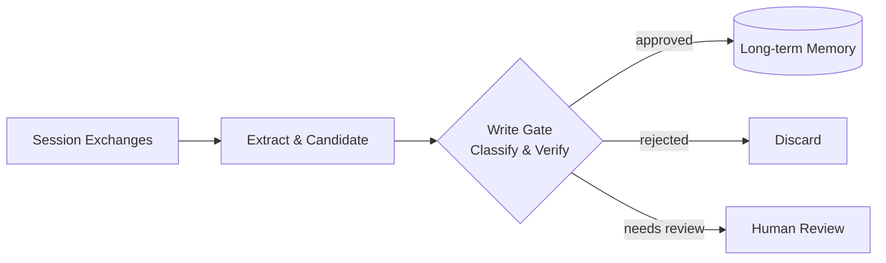

# #25 Memory Write Gate

!!! abstract "TL;DR"
    Do not unconditionally allow long-term memory writes — introduce **approval, classification, and verification gates**.

<!-- BEGIN:GEN:meta -->

Metadata (machine-readable) — #25 Memory Write Gate

| Field | Value |
|------|-----|
| **ID** | 25 |
| **Category** | 05-memory-context — Memory & Context Management |
| **Forces** | `[F8]` |
| **Dials** | memory-write-eagerness |
| **Tradeoffs** | — |
| **Related Patterns** | #23, #26, #31 |
| **When to Use** | Customer interaction history, medical/legal records, multi-session personalization |
| **When Not to Use** | Disposable tasks; stateless; gate overhead is inappropriate |
| **Element Technologies** | Presidio, DLP, NER, rule/LLM classification, metadata-tagged KVS/VectorDB |

<!-- END:GEN:meta -->

## Overview

If an agent "permanently remembers" something the user said as a joke, or temporary test data, the next session may return irrelevant responses or unintentionally retain personal information. When agents write everything they learn during a session into long-term memory, misinformation, temporary context, and personal data accumulate indiscriminately, degrading subsequent session quality. Memory Write Gate inserts verification logic into the promotion path from short-term to long-term memory. It evaluates write candidates on "should this be saved," "classification (fact/preference/procedure)," and "sensitivity level," persisting only those that meet conditions.

!!! info "Position in Decision Framework"
    - **Driving Forces**: `[F8]` Accountability & Regulation
    - **Related Decisions**: [Tuning Dials](../../decisions/tuning-dials.md) — Memory Write Eagerness
    - **Decision Flow**: [Decision Flow](../../decisions/decision-flow.md)

## Design

Gate implementation can be chosen progressively. The lightest is rule-based (keyword filters, PII detection), followed by LLM-based summarization and classification, with the most rigorous being human approval. At write time, metadata (source session ID, timestamp, confidence score) is attached for later auditing and expiration.

## Problem Solved

Without a gate, "incorrectly learned information" becomes fixed in long-term memory and is repeatedly referenced in subsequent sessions (memory contamination). In regulated domains `[F8]`, inaccurate customer information or outdated regulatory interpretations remaining in memory poses legal risk. This also prevents the data protection issue of PII and sensitive information being unintentionally persisted.

## When to Use / When Not to Use

- **When to Use**: Suitable for customer interaction history accumulation, medical/legal judgment records, and multi-session personalization.
- **When Not to Use**: Unnecessary for short-term disposable tasks or stateless designs with no memory. Also not suited when gate evaluation cost itself becomes overhead.

## Element Technologies

- PII Detection: Presidio, regex filters, DLP API
- Classification: LLM-based summarization and importance assessment prompts
- Approval: Integration with [#31 Human Approval Checkpoint](../06-reliability/31-human-approval-checkpoint.md)
- Store: KVS / vector DB with timestamp and source metadata

## Related Patterns

- [#23 Layered Memory](23-layered-memory.md) — Provides the layered structure that the gate controls
- [#26 Forgetting and Expiration](26-forgetting-and-expiration.md) — Manages expiration of written memories
- [#42 Data Boundary Firewall](../09-security/42-data-boundary-firewall.md) — Shares the same concern of PII and sensitive data inspection
