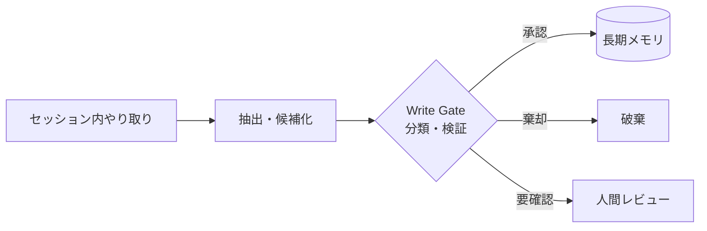

# #25 Memory Write Gate｜メモリ書き込みゲート

!!! abstract "一言"
    長期メモリへの書き込みを**無条件に許さず、承認・分類・検証のゲート**を設ける。

<!-- BEGIN:GEN:meta -->

メタデータ（機械可読） — #25 Memory Write Gate｜メモリ書き込みゲート

| 項目 | 値 |
|------|-----|
| **ID** | 25 |
| **カテゴリ** | 05-memory-context — メモリ・コンテキスト管理 |
| **フォース** | `[F8]` |
| **ダイヤル** | memory-write-eagerness |
| **二者択一** | — |
| **関連パターン** | #23, #26, #31 |
| **向き** | 顧客対話履歴、医療・法務記録、マルチセッションのパーソナライズ |
| **不向き** | 使い捨てタスク; ステートレス; ゲートのオーバーヘッドが不適 |
| **要素技術** | Presidio, DLP, NER, ルール/LLM分類, メタデータ付きKVS/VectorDB |

<!-- END:GEN:meta -->

## 概要

ユーザーが冗談で言ったことや、一時的な検証用データまでエージェントが「永久に覚えて」しまったら、次のセッションで的外れな応答を返したり、個人情報が意図せず残り続けたりする。エージェントがセッション中に得た情報をすべて長期メモリに書き込んでしまうと、誤情報・一時的な文脈・個人情報が無差別に蓄積され、後続セッションの品質を劣化させてしまう。Memory Write Gate は、短期メモリから長期メモリへの昇格パスに検証ロジックを挟むパターンである。書き込み候補を「保存すべきか」「分類（ファクト/嗜好/手順）」「機密度」の観点で評価し、条件を満たしたものだけを永続化する。

!!! info "意思決定上の位置づけ"
    - **必要にするフォース**: `[F8]` 説明責任・規制
    - **関与する決定**: [程度（ダイヤル）](../../decisions/tuning-dials.md) の メモリ書き込み積極度
    - **意思決定の進め方**: [意思決定の進め方](../../decisions/decision-flow.md)

## 設計

ゲートの実装は段階的に選ぶことができる。最も軽量なのはルールベース（キーワードフィルタ、PII検出）であり、次にLLMによる要約・分類判定、最も厳格なのは人間承認を挟む方式である。書き込み時にはメタデータ（出典セッションID、タイムスタンプ、信頼度スコア）を付与しておき、後から監査や失効ができるようにする。

## 解決する課題

ゲートがないと、「エージェントが誤って覚えた情報」が長期記憶に固定化し、以降のセッションで繰り返し参照されてしまう（記憶の汚染）。特に規制領域 `[F8]` では、不正確な顧客情報や古い規制解釈が記憶に残ることが法的リスクにつながる。また、PIIや機密情報が意図せず永続化されてしまうデータ保護上の問題も防ぐことができる。

## 向き / 不向き

- **向き**: 顧客対応履歴の蓄積、医療・法務での判断記録、マルチセッションのパーソナライズに適している。
- **不向き**: 短期的な使い捨てタスクや、メモリを持たないステートレス設計には不要である。ゲートの判定コスト自体がオーバーヘッドになる場合にも向かない。

## 要素技術

- PII検出: Presidio、正規表現フィルタ、DLP API
- 分類: LLMベースの要約・重要度判定プロンプト
- 承認: [#31 Human Approval Checkpoint](../06-reliability/31-human-approval-checkpoint.md) と連携
- ストア: タイムスタンプ・出典メタデータ付きのKVS / ベクトルDB

## 関連パターン

- [#23 Layered Memory](23-layered-memory.md) — ゲートが制御する階層構造を提供する
- [#26 Forgetting and Expiration](26-forgetting-and-expiration.md) — 書き込まれた記憶の失効を管理する
- [#42 Data Boundary Firewall](../09-security/42-data-boundary-firewall.md) — PII・機密の検査という点で同じ関心事
