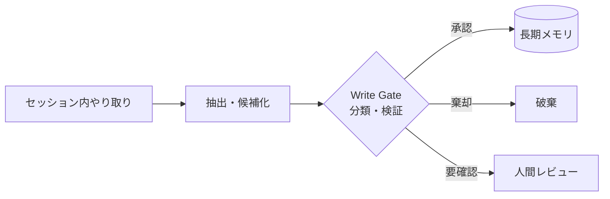

# #25 Memory Write Gate｜メモリ書き込みゲート

!!! abstract "一言"
    長期メモリへの書き込みを**無条件に許さず、承認・分類・検証のゲート**を設ける。

## 概要

エージェントがセッション中に得た情報をすべて長期メモリに書き込むと、誤情報・一時的な文脈・個人情報が無差別に蓄積され、後続セッションの品質を劣化させる。Memory Write Gate は、短期メモリから長期メモリへの昇格パスに検証ロジックを挟む。書き込み候補を「保存すべきか」「分類（ファクト/嗜好/手順）」「機密度」で評価し、条件を満たしたものだけを永続化する。

!!! info "意思決定上の位置づけ"
    - **必要にするフォース**: `[F8]` 説明責任・規制
    - **関与する決定**: [程度（ダイヤル）](../../decisions/tuning-dials.md) の メモリ書き込み積極度
    - **意思決定の進め方**: [意思決定の進め方](../../decisions/decision-flow.md)

## 設計

ゲートの実装は段階的に選べる。最も軽量なのはルールベース（キーワードフィルタ、PII検出）で、次にLLMによる要約・分類判定、最も厳格なのは人間承認を挟む方式。書き込み時にはメタデータ（出典セッションID、タイムスタンプ、信頼度スコア）を付与し、後から監査・失効できるようにする。

## 解決する課題

ゲートがないと「エージェントが誤って覚えた情報」が長期記憶に固定化し、以降のセッションで繰り返し参照される（記憶の汚染）。特に規制領域 `[F8]` では、不正確な顧客情報や古い規制解釈が記憶に残ることは法的リスクとなる。また、PIIや機密情報が意図せず永続化されるデータ保護上の問題も防ぐ。

## 向き / 不向き

- **向き**: 顧客対応履歴の蓄積、医療・法務での判断記録、マルチセッションのパーソナライズ。
- **不向き**: 短期的な使い捨てタスク、メモリを持たないステートレス設計。ゲートの判定コスト自体がオーバーヘッドになる場合。

## 要素技術

- PII検出: Presidio、正規表現フィルタ、DLP API
- 分類: LLMベースの要約・重要度判定プロンプト
- 承認: [#31 Human Approval Checkpoint](../06-reliability/31-human-approval-checkpoint.md) と連携
- ストア: タイムスタンプ・出典メタデータ付きのKVS / ベクトルDB

## 関連パターン

- [#23 Layered Memory](23-layered-memory.md) — ゲートが制御する階層構造を提供する
- [#26 Forgetting and Expiration](26-forgetting-and-expiration.md) — 書き込まれた記憶の失効を管理する
- [#42 Data Boundary Firewall](../09-security/42-data-boundary-firewall.md) — PII・機密の検査という点で同じ関心事
