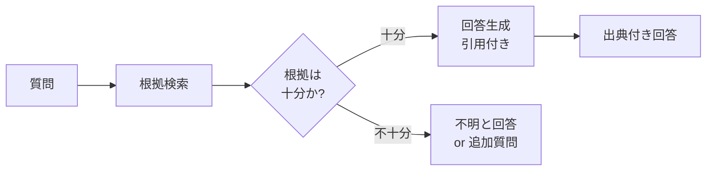

# #27 Evidence-First Answer｜根拠優先回答

!!! abstract "一言"
    回答を生成する**前に**根拠となる情報を取得し、出典付きで提示する。

## 概要

LLMは「自信たっぷりに間違える」ことがある。確信度が高くても事実に基づいていなければ、特に法務・医療・金融の領域では深刻な問題になりかねない。Evidence-First Answer は、この問題に対処するために、回答生成のワークフローを「まず根拠を集め、次にそれに基づいて回答を構成する」という二段階に分離するパターンである。根拠が見つからない場合は「わからない」と明示的に返す。回答には引用（出典ドキュメント、チャンク、URL）を付与し、ユーザーや監査者が検証できるようにする。

!!! info "意思決定上の位置づけ"
    - **必要にするフォース**: `[F8]` 説明責任・規制
    - **関与する決定**: [相反](../../decisions/tradeoffs.md) の RAG↔FT↔ロングコンテキスト
    - **意思決定の進め方**: [意思決定の進め方](../../decisions/decision-flow.md)

## 設計

検索フェーズでは [#24 Context Pack / Assembly](../05-memory-context/24-context-pack-assembly.md) と同じ仕組みを使うが、ここでは「回答可能か」の判定ステップが加わる。引用形式はインライン脚注（`[1]`）やメタデータブロックなど、下流の用途に合わせて選ぶ。

## 解決する課題

ハルシネーションの最も危険な形態は「もっともらしいが根拠のない回答」である。特に規制領域 `[F8]`（法務、医療、金融）では、根拠のない助言が法的責任につながりかねない。Evidence-First は回答の生成経路を根拠取得に依存させることで、「根拠なしに答えてしまう」パスを構造的に排除する。

## 向き / 不向き

- **向き**: 法務・医療・金融の質問応答、社内ナレッジ検索、監査対応が必要なカスタマーサポートに適している。
- **不向き**: 創作やブレインストーミングなど正解のないタスクや、根拠ソースが存在しない探索的対話には向かない。

## 要素技術

- 根拠検索: RAGパイプライン、Web検索API、社内ドキュメントAPI
- 十分性判定: LLMによる自己評価（confidence score）、検索スコア閾値
- 引用付与: チャンクID・URLをメタデータとして回答に埋め込む
- 表示: フロントエンドでの脚注レンダリング、出典リンク

## 関連パターン

- [#24 Context Pack / Assembly](../05-memory-context/24-context-pack-assembly.md) — 根拠検索の実装基盤
- [#28 Verifier Agent / Critic](28-verifier-agent-critic.md) — 生成後に独立検証を追加する補完パターン
- [#14 Structured Output Contract](../03-io-contract/14-structured-output-contract.md) — 引用メタデータをスキーマで契約化する

## 参考

- Gao et al., "RARR: Researching and Revising What Language Models Say" (2023)
