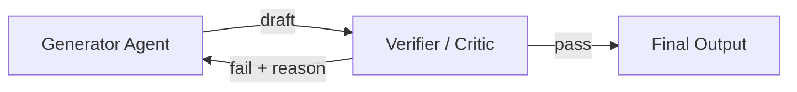

# #28 Verifier Agent / Critic

!!! abstract "TL;DR"
    An **independent verifier** inspects output separately from the generating agent, rejecting it if criteria are not met.

<!-- BEGIN:GEN:meta -->

Metadata (machine-readable) — #28 Verifier Agent / Critic

| Field | Value |
|------|-----|
| **ID** | 28 |
| **Category** | 06-reliability — Reliability, Verification, Guardrails & Autonomy |
| **Forces** | `[F2]`, `[F4]` |
| **Dials** | self-correction-loops |
| **Tradeoffs** | inline-vs-post-verification, same-vs-different-model |
| **Related Patterns** | #8, #27, #29 |
| **When to Use** | Code generation (test verification), financial reports, legal documents, published content |
| **When Not to Use** | Real-time chat; low-failure-cost brainstorming |
| **Element Technologies** | Separate LLM/rule checker, unit test execution, URL verification, max-retry+timeout |

<!-- END:GEN:meta -->

## Overview

Just as it is difficult to notice errors in a report you wrote yourself, having the same agent generate and verify makes it prone to overlooking its own mistakes (self-confirmation bias). The Verifier Agent pattern has a separate agent (Critic) receive the generated draft and inspect it for factual consistency, format compliance, and policy violations. If it fails, feedback is returned to the generator requesting correction. By separating generation and verification concerns, inspection criteria can evolve independently.

!!! info "Position in Decision Framework"
    - **Driving Forces**: `[F2]` Failure Cost, `[F4]` Latency Budget
    - **Related Decisions**: [Tradeoffs](../../decisions/tradeoffs.md) — Inline ↔ Post-Verification, Same ↔ Different Model Verification
    - **Decision Flow**: [Decision Flow](../../decisions/decision-flow.md)

## Design

Verification implementation can combine multiple approaches: LLM-based critique ("does this answer contain factual errors?"), rule-based checks (JSON Schema validation, prohibited word detection), and external tool calls (recalculating computation results, URL existence verification). Retry count has an upper limit — when exceeded, escalate to humans or return a safe fallback.

## Problem Solved

In `[F2]` high-failure-cost domains, shipping generated output as-is is unacceptable. Separating the verifier makes "what was inspected and by what criteria" traceable in logs, enabling auditing. However, verification steps add additional LLM calls, increasing latency `[F4]`. Therefore, verification depth is determined by the trade-off between failure cost and latency budget.

## When to Use / When Not to Use

- **When to Use**: Suitable for code generation (verifiable by test execution), financial reports, legal documents, and customer-facing published content.
- **When Not to Use**: Not suited for interactive chat requiring real-time response, or brainstorming output where failure cost is low.

## Element Technologies

- LLM Critic: Critique generation with separate prompt / separate model
- Rule Verification: JSON Schema, regex, prohibited word lists
- Tool Verification: Unit test execution, formula recalculation, URL reachability checks
- Loop Control: Max retry count, timeout

## Selection (Tradeoffs)

- **Verification depth ↔ Latency** — Multi-layer verification improves quality but increases latency `[F2][F4]`. Add verification layers in proportion to failure cost. → [Tradeoff Selection Criteria](../../decisions/tradeoffs.md)

## Related Patterns

- [#8 Planner-Executor-Reviewer](../02-composition/08-planner-executor-reviewer.md) — Incorporates the Verifier as the Reviewer role
- [#27 Evidence-First Answer](27-evidence-first-answer.md) — Combines with pre-generation evidence for double defense
- [#29 Guardrail Sidecar + Self-Correction](29-guardrail-sidecar-self-correction.md) — An approach that inspects inline on the generation path
