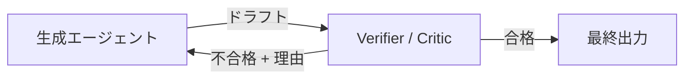

# #28 Verifier Agent / Critic｜検証エージェント

!!! abstract "一言"
    生成エージェントとは**独立した検証器**が出力を検査し、基準を満たさなければ差し戻す。

## 概要

生成と検証を同一のエージェントに任せると、自身の誤りに気づきにくい（自己確証バイアス）。Verifier Agent は、生成されたドラフトを別のエージェント（Critic）が受け取り、事実整合性・フォーマット遵守・ポリシー違反などの観点で検査する。不合格なら生成側へフィードバックを返し、修正を要求する。生成と検証の関心を分離することで、検査基準を独立に進化させられる。

## 設計

検証の実装は複数組み合わせられる。LLMベースの批評（「この回答に事実誤認はないか」）、ルールベースのチェック（JSON Schema検証、禁止語検出）、外部ツール呼び出し（計算結果の再検算、URLの存在確認）など。リトライ回数には上限を設け、上限超過時は人間エスカレーションか安全なフォールバックを返す。

## 解決する課題

失敗コストの高い `[F2]` 領域では、生成物をそのまま出荷することが許容されない。検証器を分離することで「何を・どの基準で検査したか」がトレースに残り、監査可能になる。一方、検証ステップは追加のLLM呼び出しを伴うためレイテンシが増加する `[F4]`。検証の深さは失敗コストとレイテンシ予算のトレードオフで決まる。

## 向き / 不向き

- **向き**: コード生成（テスト実行で検証）、金融レポート、法的文書、顧客向け公開コンテンツ。
- **不向き**: 対話的なチャットでリアルタイム応答が求められる場面、失敗コストが低いブレスト出力。

## 要素技術

- LLM Critic: 別プロンプト・別モデルでの批評生成
- ルール検証: JSON Schema、正規表現、禁止語リスト
- ツール検証: ユニットテスト実行、数式再計算、URL疎通確認
- ループ制御: 最大リトライ回数、タイムアウト

## 選定（相反）

- **検証の深さ ↔ レイテンシ** — 多段検証は品質を上げるがレイテンシが増大 `[F2][F4]`。失敗コストに比例して検証層を増やす。→ [相反の選定基準](../../decisions/tradeoffs.md)

## 関連パターン

- [#8 Planner-Executor-Reviewer](../02-composition/08-planner-executor-reviewer.md) — Reviewer ロールとして Verifier を組み込む構成
- [#27 Evidence-First Answer](27-evidence-first-answer.md) — 生成前の根拠確保と組み合わせて二重防御
- [#29 Guardrail Sidecar + Self-Correction](29-guardrail-sidecar-self-correction.md) — 生成パス上でインラインに検査するアプローチ
