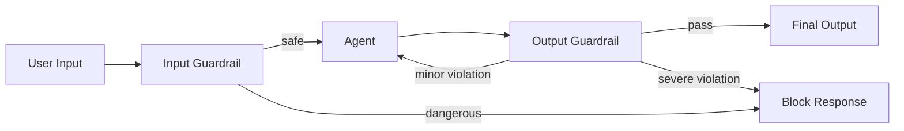

# #29 Guardrail Sidecar + Self-Correction

!!! abstract "TL;DR"
    **Inspect agent I/O with a sidecar**, auto-correcting or blocking when violations are detected.

<!-- BEGIN:GEN:meta -->

Metadata (machine-readable) — #29 Guardrail Sidecar + Self-Correction

| Field | Value |
|------|-----|
| **ID** | 29 |
| **Category** | 06-reliability — Reliability, Verification, Guardrails & Autonomy |
| **Forces** | `[F5]`, `[F4]` |
| **Dials** | guardrail-strictness |
| **Tradeoffs** | inline-vs-post-verification |
| **Related Patterns** | #30, #28, #44 |
| **When to Use** | Public chatbots, external API input, compliance requirements, auto-correction acceptable |
| **When Not to Use** | Internal trusted input only; real-time zero-latency requirements; offline batch |
| **Element Technologies** | Guardrails AI, NeMo Guardrails, LLM-Guard, PII detection, toxicity classifiers |

<!-- END:GEN:meta -->

## Overview

Malicious prompts being input to public chatbots, or agents returning policy-violating answers — such scenarios become increasingly unavoidable as user numbers grow. Guardrail Sidecar is middleware that intercepts both agent input (user prompts) and output (generated text, tool invocations), detecting policy violations, harmful content, and prompt injection. For minor violations, it sends correction instructions back to the generator to prompt Self-Correction; for severe violations, it blocks the response and returns a safe fallback. A key feature is that it can be deployed and updated independently of the main agent logic.

!!! info "Position in Decision Framework"
    - **Driving Forces**: `[F5]` Input Trustworthiness, `[F4]` Latency Budget
    - **Related Decisions**: [Tuning Dials](../../decisions/tuning-dials.md) — Guardrail Strictness, Self-Correction Loop Count / [Tradeoffs](../../decisions/tradeoffs.md) — Inline ↔ Post-Verification
    - **Decision Flow**: [Decision Flow](../../decisions/decision-flow.md)

## Design

Input guardrails handle prompt injection detection, topic restriction, and PII detection. Output guardrails handle toxicity assessment, fact checking, and format validation. Self-Correction feeds the output guardrail's findings as additional context back to the agent for regeneration. Retry count is capped according to `[F4]`.

## Problem Solved

Agents receiving external input have a broad attack surface `[F5]`. Preventing prompt injection and unintended topic deviation through the main logic alone is difficult, requiring an independent inspection layer. As a sidecar, guardrail rule updates can be applied independently of agent deployments, enabling immediate changes.

## When to Use / When Not to Use

- **When to Use**: Suitable for chatbots exposed to the general public, API agents processing external input, and services with compliance requirements.
- **When Not to Use**: Excessive for internal batch processing with fully trusted input. Also, inspection latency may be unacceptable for real-time paths with extremely strict latency constraints.

## Element Technologies

- Input Inspection: Guardrails AI, NeMo Guardrails, LLM-Guard, regex filters
- Output Inspection: Toxicity classifiers, LLM judge, schema validation
- Self-Correction: Append violation reasons to system prompt and regenerate
- Deployment: Sidecar container, API Gateway plugin

## Tuning (Dials)

- **Inspection strictness** — Too strict blocks normal I/O (false positives); too lenient lets violations through / Deciding factors: `[F5][F4]` / Adjust via score thresholds. → [Tuning Dials](../../decisions/tuning-dials.md)

## Related Patterns

- [#30 Policy-as-Code Guardrail](30-policy-as-code-guardrail.md) — A method to manage guardrail rules as code
- [#28 Verifier Agent / Critic](28-verifier-agent-critic.md) — Implements output guardrails as deeper verification
- [#44 Dual-LLM Privilege Separation](../09-security/44-dual-llm-privilege-separation.md) — Separates input processing and privileged operations at the LLM level
