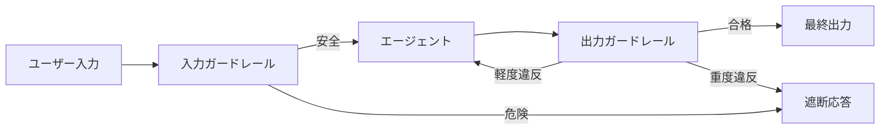

# #29 Guardrail Sidecar + Self-Correction｜ガードレール

!!! abstract "一言"
    エージェントの**入出力をサイドカーで検査**し、違反を検出したら自動修正または遮断する。

## 概要

Guardrail Sidecar は、エージェントの入力（ユーザープロンプト）と出力（生成テキスト・ツール呼び出し）の両方をインターセプトし、ポリシー違反・有害コンテンツ・プロンプトインジェクションを検出するミドルウェアである。違反を検出した場合、軽度なら生成側に修正指示を戻して Self-Correction を促し、重度なら応答を遮断して安全なフォールバックを返す。本体のエージェントロジックとは独立にデプロイ・更新できる。

!!! info "意思決定上の位置づけ"
    - **必要にするフォース**: `[F5]` 入力の信頼度・`[F4]` レイテンシ予算
    - **関与する決定**: [程度（ダイヤル）](../../decisions/tuning-dials.md) の ガードレール厳しさ・自己修正ループ回数 / [相反](../../decisions/tradeoffs.md) の インライン↔事後検証
    - **意思決定の進め方**: [意思決定の進め方](../../decisions/decision-flow.md)

## 設計

入力ガードレールはプロンプトインジェクション検出、トピック制限、PII検出を行う。出力ガードレールは有害性判定、ファクトチェック、フォーマット検証を行う。Self-Correction は、出力ガードレールの指摘を追加コンテキストとしてエージェントへフィードバックし、再生成させるループである。再試行回数は `[F4]` に応じて上限を設ける。

## 解決する課題

外部入力を受けるエージェントは攻撃面が広い `[F5]`。プロンプトインジェクションや意図しないトピック逸脱を本体ロジックだけで防ぐのは困難で、独立した検査層が必要になる。サイドカーとして分離することで、ガードレールのルール更新がエージェント本体のデプロイと独立し、即時適用できる。

## 向き / 不向き

- **向き**: 不特定多数のユーザーに公開するチャットボット、外部入力を処理するAPIエージェント、コンプライアンス要件のあるサービス。
- **不向き**: 入力が完全に信頼できる内部バッチ処理、レイテンシ制約が極端に厳しいリアルタイムパス（ガードレールの検査遅延が許容できない場合）。

## 要素技術

- 入力検査: Guardrails AI、NeMo Guardrails、LLM-Guard、正規表現フィルタ
- 出力検査: 有害性分類器、LLMジャッジ、スキーマバリデーション
- Self-Correction: 違反理由をシステムプロンプトに追記して再生成
- デプロイ: サイドカーコンテナ、API Gateway プラグイン

## 調整（程度）

- **検査の厳格度** — 厳しすぎると正常な入出力も遮断（偽陽性）、緩すぎると漏れる / 決め手 `[F5][F4]` / スコア閾値で段階調整。→ [程度ダイヤル](../../decisions/tuning-dials.md)

## 関連パターン

- [#30 Policy-as-Code Guardrail](30-policy-as-code-guardrail.md) — ガードレールのルールをコードとして管理する手法
- [#28 Verifier Agent / Critic](28-verifier-agent-critic.md) — 出力ガードレールをより深い検証として実装する
- [#44 Dual-LLM Privilege Separation](../09-security/44-dual-llm-privilege-separation.md) — 入力処理と特権操作をLLMレベルで分離する
