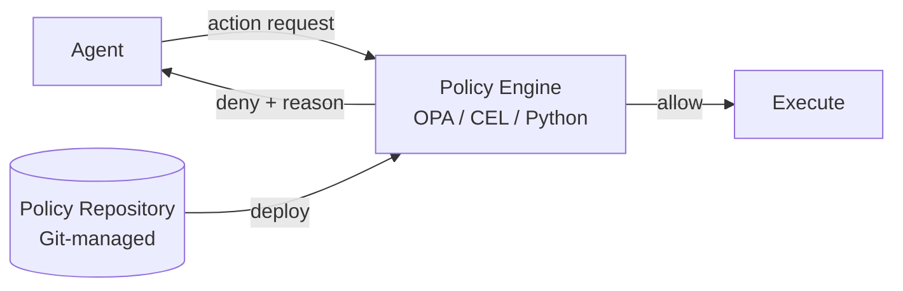

# #30 Policy-as-Code Guardrail

!!! abstract "TL;DR"
    Define agent behavioral constraints not in natural language instructions but as **code (rule engines)**, evaluating them deterministically.

<!-- BEGIN:GEN:meta -->

Metadata (machine-readable) — #30 Policy-as-Code Guardrail

| Field | Value |
|------|-----|
| **ID** | 30 |
| **Category** | 06-reliability — Reliability, Verification, Guardrails & Autonomy |
| **Forces** | `[F2]`, `[F8]` |
| **Dials** | — |
| **Tradeoffs** | prompt-vs-code |
| **Related Patterns** | #29, #18, #52 |
| **When to Use** | High-failure-cost operations in finance/medical/legal, audit trails required, deterministic rules possible |
| **When Not to Use** | Ambiguous rules (tone judgment); domains too vague to formalize |
| **Element Technologies** | OPA/Rego, Google CEL, AWS Cedar, Python functions, Git management, policy test suites |

<!-- END:GEN:meta -->

## Overview

"Do not output personal medical information," "limit deletions to 10 per operation" — writing such constraints in natural language within prompts cannot reduce the probability of LLM non-compliance to zero. Policy-as-Code defines behavioral constraints as deterministic code — OPA (Open Policy Agent), Rego, CEL, Python functions — and sets up an external gate to evaluate agent outputs and tool invocations. By combining soft prompt-based control with hard code-based control, regulatory requirements `[F8]` can be reliably met.

!!! info "Position in Decision Framework"
    - **Driving Forces**: `[F2]` Failure Cost, `[F8]` Accountability & Regulation
    - **Related Decisions**: [Tuning Dials](../../decisions/tuning-dials.md) — Guardrail Strictness / [Tradeoffs](../../decisions/tradeoffs.md) — Prompt ↔ Code Control
    - **Decision Flow**: [Decision Flow](../../decisions/decision-flow.md)

## Design

Policies are managed in a Git repository, with changes going through PR review before deployment. Evaluation logs (input, policy ID, result) are all recorded as audit trails. Policy examples: "max 10 records deletable per API call," "responses containing personal medical information are prohibited," "transfer operations outside business hours are not allowed."

## Problem Solved

Natural language instruction-based constraints are probabilistic and insufficient as a safety valve for `[F2]` high-failure-cost operations. Codified policies offer: (1) reproducible evaluation results, (2) testability, (3) version control, (4) precise auditable identification of "which rule was applied." That is, regardless of what the LLM generates, the policy engine deterministically determines final execution eligibility.

## When to Use / When Not to Use

- **When to Use**: Suitable for financial transactions, medical decision support, data deletion, and permission changes — operations with high failure costs or regulatory requirements.
- **When Not to Use**: Not suited for constraints that are ambiguous and hard to formalize (subjective judgments like "inappropriate tone"). For such domains, [#29 Guardrail Sidecar](29-guardrail-sidecar-self-correction.md) LLM-based inspection plays a complementary role.

## Element Technologies

- Policy Engine: OPA / Rego, Google CEL, AWS Cedar, Python functions
- Management: Git repository + CI/CD pipeline, policy test suites
- Evaluation Log: Structured logs (JSON), audit tables

## Related Patterns

- [#29 Guardrail Sidecar + Self-Correction](29-guardrail-sidecar-self-correction.md) — Used alongside LLM-based soft guardrails
- [#18 Least-Privilege Tool Binding](../04-tools-mcp/18-least-privilege-tool-binding.md) — An implementation of the same idea as tool permission restriction
- [#52 Agent Constitution](../12-governance/52-agent-constitution.md) — The higher-level concept of systematizing behavioral principles as policies
