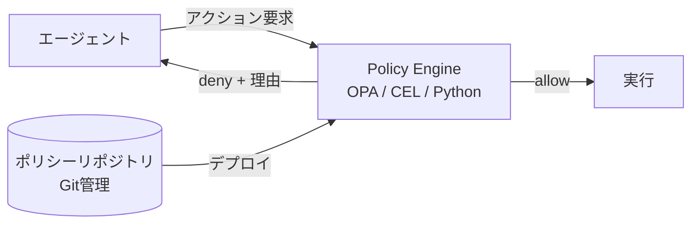

# #30 Policy-as-Code Guardrail｜ポリシー・アズ・コード

!!! abstract "一言"
    エージェントの行動制約を**自然言語の指示ではなくコード（ルールエンジン）**で定義し、決定論的に判定する。

<!-- BEGIN:GEN:meta -->

メタデータ（機械可読） — #30 Policy-as-Code Guardrail｜ポリシー・アズ・コード

| 項目 | 値 |
|------|-----|
| **ID** | 30 |
| **カテゴリ** | 06-reliability — 信頼性・検証・ガードレール・自律 |
| **フォース** | `[F2]`, `[F8]` |
| **ダイヤル** | — |
| **二者択一** | prompt-vs-code |
| **関連パターン** | #29, #18, #52 |
| **向き** | 金融・医療・法務の高失敗コスト操作、監査証跡が必要、決定論的ルールが可能 |
| **不向き** | 曖昧なルール（トーン判断）; 形式が曖昧なドメイン |
| **要素技術** | OPA/Rego, Google CEL, AWS Cedar, Python関数, Git管理, ポリシーテストスイート |

<!-- END:GEN:meta -->

## 概要

「個人の医療情報を出力してはいけない」「1回の削除は10件まで」――こうした制約をプロンプトに自然言語で書いただけでは、LLMが指示を無視する確率をゼロにすることはできない。Policy-as-Code は、行動制約をOPA（Open Policy Agent）、Rego、CEL、Python関数といった決定論的コードとして定義し、エージェントの出力やツール呼び出しを判定する外部ゲートを設けるパターンである。プロンプトによるソフトな制御と、コードによるハードな制御を組み合わせることで、規制要件 `[F8]` を確実に充足できる。

!!! info "意思決定上の位置づけ"
    - **必要にするフォース**: `[F2]` 失敗コスト・`[F8]` 説明責任・規制
    - **関与する決定**: [程度（ダイヤル）](../../decisions/tuning-dials.md) の ガードレール厳しさ / [相反](../../decisions/tradeoffs.md) の プロンプト↔コード制御
    - **意思決定の進め方**: [意思決定の進め方](../../decisions/decision-flow.md)

## 設計

ポリシーはGitリポジトリで管理し、変更はPRレビューを経てデプロイする。判定ログ（入力・ポリシーID・結果）はすべて記録し、監査証跡とする。ポリシーの例: 「1回のAPI呼び出しで削除できるレコードは10件まで」「個人の医療情報を含む応答は禁止」「営業時間外の送金操作は不許可」。

## 解決する課題

自然言語指示ベースの制約は確率的であり、失敗コストの高い `[F2]` 操作の安全弁としては不十分である。コード化されたポリシーには次のような利点がある。(1) 判定結果が再現可能、(2) テスト可能、(3) バージョン管理可能、(4) 監査で「どのルールが適用されたか」を正確に示せる。つまり、LLMが何を生成したとしても、最終的な実行可否はポリシーエンジンが決定論的に判断する。

## 向き / 不向き

- **向き**: 金融取引、医療判断支援、データ削除、権限変更など、失敗コストや規制要件が高い操作に適している。
- **不向き**: 制約が曖昧で形式化しにくいタスク（「トーンが不適切」などの主観的判断）には向かない。そうした領域では、[#29 Guardrail Sidecar](29-guardrail-sidecar-self-correction.md) のLLMベース検査が補完的な役割を果たす。

## 要素技術

- ポリシーエンジン: OPA / Rego、Google CEL、AWS Cedar、Python関数
- 管理: Gitリポジトリ + CI/CDパイプライン、ポリシーテストスイート
- 判定ログ: 構造化ログ（JSON）、監査テーブル

## 関連パターン

- [#29 Guardrail Sidecar + Self-Correction](29-guardrail-sidecar-self-correction.md) — LLMベースのソフトガードレールと併用する
- [#18 Least-Privilege Tool Binding](../04-tools-mcp/18-least-privilege-tool-binding.md) — ツールの権限制限という同じ発想の実装
- [#52 Agent Constitution](../12-governance/52-agent-constitution.md) — 行動原則をポリシーとして体系化する上位概念
