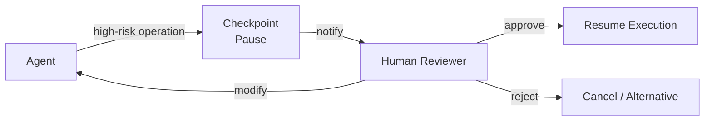

# #31 Human Approval Checkpoint

!!! abstract "TL;DR"
    **Pause execution just before** irreversible or high-cost operations and obtain explicit human approval before continuing.

<!-- BEGIN:GEN:meta -->

Metadata (machine-readable) — #31 Human Approval Checkpoint

| Field | Value |
|------|-----|
| **ID** | 31 |
| **Category** | 06-reliability — Reliability, Verification, Guardrails & Autonomy |
| **Forces** | `[F2]`, `[F1]` |
| **Dials** | autonomy-level, hitl-frequency |
| **Tradeoffs** | — |
| **Related Patterns** | #57, #19, #6 |
| **When to Use** | Finance, infrastructure changes, customer email sending, contract confirmation |
| **When Not to Use** | Real-time chat; human unavailable (switch to #30 automation); read-only |
| **Element Technologies** | Durable Session, Slack/Teams/email notification, approval UI dashboard, RBAC, timeout logic |

<!-- END:GEN:meta -->

## Overview

The agent is about to execute a fund transfer to a customer, or about to delete a production database table — if the judgment is wrong, the consequences are irreversible. As agent autonomy increases, the risk of incorrect judgments leading to irreversible results also grows. Human Approval Checkpoint pauses agent execution at specific points in the workflow and asks humans for "approve/reject/modify" decisions. During the approval wait, the agent's session state is persisted, and processing resumes after approval is obtained.

!!! info "Position in Decision Framework"
    - **Driving Forces**: `[F2]` Failure Cost, `[F1]` Reversibility
    - **Related Decisions**: [Tuning Dials](../../decisions/tuning-dials.md) — HITL Frequency
    - **Decision Flow**: [Decision Flow](../../decisions/decision-flow.md)

## Design

Checkpoint placement is determined based on operation irreversibility `[F1]` and failure cost `[F2]`. Putting approvals on every step drastically reduces throughput, so risk-assessment-based selective placement is key. Approval requests include operation summaries, impact scope, and rationale so humans can make quick decisions.

## Problem Solved

When agents independently execute irreversible operations (production DB changes, fund transfers, contract submission), recovery costs from misjudgments are extremely high. Checkpoints maintain the benefits of automation while securing human judgment as the "last line of defense." Approval logs also serve as audit trails for regulatory compliance.

## When to Use / When Not to Use

- **When to Use**: Suitable for financial transaction execution, infrastructure changes, customer-facing email sending, and legal document finalization.
- **When Not to Use**: Not suited for real-time chat requiring immediate response. For overnight batch processing where human reviewers are unavailable, consider [#30 Policy-as-Code](30-policy-as-code-guardrail.md) automated evaluation as an alternative.

## Element Technologies

- Pause & Resume: [#2 Durable Agent Session](../01-execution/02-durable-agent-session.md) state persistence
- Notification: Slack / Teams / email notification, approval UI dashboard
- Approval Flow: RBAC (approval permission control), timeout-based approval (auto-reject after set time)
- Logging: Record approver, timestamp, and decision rationale

## Tuning (Dials)

- **Checkpoint granularity** — Too fine makes humans a bottleneck; too coarse lets dangerous operations pass through / Deciding factors: `[F1][F2]` / Judge by the product of irreversibility and failure cost. → [Tuning Dials](../../decisions/tuning-dials.md)

## Selection (Tradeoffs)

- **Autonomous Execution ↔ Human Approval** — As trust accumulates, widen the scope of approval-free operations. Combine with [#57 Autonomy Ladder](57-autonomy-ladder.md) for graduated adjustment `[F1][F2]`. → [Tradeoff Selection Criteria](../../decisions/tradeoffs.md)

## Related Patterns

- [#57 Autonomy Ladder](57-autonomy-ladder.md) — Relaxes approval checkpoints based on track record
- [#19 Dry-Run First Tool Execution](../04-tools-mcp/19-dry-run-first-tool-execution.md) — Confirm impact via dry-run before approval
- [#6 Interruptible Agent](../01-execution/06-interruptible-agent.md) — The interrupt-resume foundation that includes approval waiting
