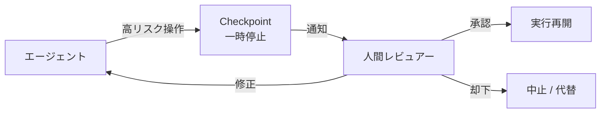

# #31 Human Approval Checkpoint｜人間承認チェックポイント

!!! abstract "一言"
    不可逆または高コストな操作の**直前で実行を一時停止**し、人間の明示的な承認を得てから続行する。

<!-- BEGIN:GEN:meta -->

メタデータ（機械可読） — #31 Human Approval Checkpoint｜人間承認チェックポイント

| 項目 | 値 |
|------|-----|
| **ID** | 31 |
| **カテゴリ** | 06-reliability — 信頼性・検証・ガードレール・自律 |
| **フォース** | `[F2]`, `[F1]` |
| **ダイヤル** | autonomy-level, hitl-frequency |
| **二者択一** | — |
| **関連パターン** | #57, #19, #6 |
| **向き** | 金融、インフラ変更、顧客メール送信、契約確認 |
| **不向き** | リアルタイムチャット; 人間不在（#30の自動化に切替）; 読み取り専用 |
| **要素技術** | Durable Session, Slack/Teams/email通知, 承認UIダッシュボード, RBAC, タイムアウトロジック |

<!-- END:GEN:meta -->

## 概要

エージェントが顧客への送金を実行しようとしている、本番データベースのテーブルを削除しようとしている――こうした場面で、もし判断が間違っていたら取り返しがつかない。エージェントの自律性が高まるほど、誤った判断が不可逆な結果をもたらすリスクも増していく。Human Approval Checkpoint は、ワークフロー上の特定ポイントでエージェントの実行を一時停止し、人間に「承認/却下/修正」の判断を求めるパターンである。承認待ちの間、エージェントのセッション状態は永続化され、承認が得られた後に処理を再開する。

!!! info "意思決定上の位置づけ"
    - **必要にするフォース**: `[F2]` 失敗コスト・`[F1]` 可逆性
    - **関与する決定**: [程度（ダイヤル）](../../decisions/tuning-dials.md) の HITL頻度
    - **意思決定の進め方**: [意思決定の進め方](../../decisions/decision-flow.md)

## 設計

チェックポイントの配置は、操作の不可逆性 `[F1]` と失敗コスト `[F2]` に基づいて決める。すべてのステップに承認を入れるとスループットが大幅に低下するため、リスク評価に基づく選択的な配置が重要になる。承認リクエストには操作の要約・影響範囲・根拠を含め、人間が短時間で判断できるようにしておく。

## 解決する課題

不可逆な操作（本番DBの変更、資金移動、契約送信など）をエージェントが単独で実行してしまうと、誤判断時の回復コストが極めて高くなる。チェックポイントを挟むことで、自動化の恩恵を維持しながら「最後の砦」としての人間判断を確保できる。また、承認ログは監査証跡として規制対応にも活用できる。

## 向き / 不向き

- **向き**: 金融取引の実行、インフラ変更、顧客向けメール送信、法的文書の確定などに適している。
- **不向き**: リアルタイム応答が必須のチャットには向かない。また、人間のレビュアーが確保できない深夜バッチ処理では、代替として [#30 Policy-as-Code](30-policy-as-code-guardrail.md) による自動判定を検討するとよい。

## 要素技術

- 一時停止・再開: [#2 Durable Agent Session](../01-execution/02-durable-agent-session.md) のステート永続化
- 通知: Slack / Teams / メール通知、承認UIダッシュボード
- 承認フロー: RBAC（承認権限の制御）、タイムアウト付き承認（一定時間で自動却下）
- ログ: 承認者・タイムスタンプ・判断理由の記録

## 調整（程度）

- **チェックポイントの粒度** — 細かすぎると人間がボトルネック化、粗すぎると危険な操作が素通り / 決め手 `[F1][F2]` / 不可逆性と失敗コストの積で判断。→ [程度ダイヤル](../../decisions/tuning-dials.md)

## 選定（相反）

- **自律実行 ↔ 人間承認** — 信頼が蓄積するにつれ承認なしの範囲を広げる。[#57 Autonomy Ladder](57-autonomy-ladder.md) と組み合わせて段階的に調整 `[F1][F2]`。→ [相反の選定基準](../../decisions/tradeoffs.md)

## 関連パターン

- [#57 Autonomy Ladder](57-autonomy-ladder.md) — 実績に応じて承認チェックポイントを緩和する
- [#19 Dry-Run First Tool Execution](../04-tools-mcp/19-dry-run-first-tool-execution.md) — 承認前にドライランで影響を確認する
- [#6 Interruptible Agent](../01-execution/06-interruptible-agent.md) — 承認待ちを含む中断・再開の基盤
