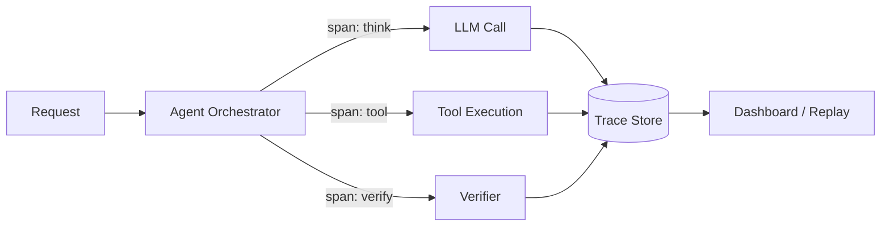

# #32 Agent Trace

!!! abstract "TL;DR"
    Record every step of an agent -- reasoning, tool calls, responses -- as **append-only logs** for later replay and auditing.

<!-- BEGIN:GEN:meta -->

Metadata (machine-readable) — #32 Agent Trace

| Field | Value |
|------|-----|
| **ID** | 32 |
| **Category** | 07-observability — Observability, Auditing & Evaluation |
| **Forces** | `[F8]` |
| **Dials** | trace-sampling-rate |
| **Tradeoffs** | — |
| **Related Patterns** | #54, #33, #35 |
| **When to Use** | Multi-step agents, regulatory auditing, complex systems with model/tool combinations |
| **When Not to Use** | Single-call stateless APIs; standard application logs are sufficient |
| **Element Technologies** | OpenTelemetry, Langfuse, LangSmith, Arize Phoenix, ClickHouse, BigQuery, S3+Parquet |

<!-- END:GEN:meta -->

## Overview

When an agent returns an incorrect answer, improvement is impossible if you cannot trace "why it happened." Being able to reconstruct which tools were called, what intermediate results were obtained, and how the final answer was reached is essential for production operations.

This pattern writes out each step the agent takes while processing a single request (LLM calls, tool executions, internal decisions) as spans in a distributed tracing system to an append-only store. Each span includes input, output, latency, token count, and model version, organized into a tree structure per session. This enables reconstructing "why that result occurred" after the fact, forming the foundation for failure analysis, compliance auditing, and quality improvement.

!!! info "Position in decision-making"
    - **Driving force**: `[F8]` Accountability & Regulation
    - **Related decision**: Trace sampling rate in [Tuning Dials](../../decisions/tuning-dials.md)
    - **Decision flow**: [Decision Flow](../../decisions/decision-flow.md)

## Design

Each step in the orchestrator generates a span that is asynchronously sent to the Trace Store. The Trace Store is append-only and resistant to tampering. Traces can be visualized, filtered, searched, and aggregated through dashboards and replay tools.

## Problems Solved

Agent outputs are non-deterministic -- the same input may follow different paths. Without traces, you cannot reproduce "why a wrong answer was given" or "which tool call caused the latency," leaving improvement to guesswork. In regulated industries, audit trails may also be a legal requirement `[F8]`, making traces an indispensable foundation.

## When to Use / When Not to Use

- **When to Use**: Multi-step agents, domains with regulatory or compliance requirements, configurations combining multiple models and tools.
- **When Not to Use**: Single stateless inference APIs that complete in one LLM call where standard application logs are sufficient -- tracing becomes overkill.

## Element Technologies

- Tracing infrastructure: OpenTelemetry, Langfuse, LangSmith, Arize Phoenix
- Store: ClickHouse, BigQuery, S3 + Parquet (cold tier)
- Visualization: Grafana, Jaeger, built-in UIs of tracing platforms

## Tuning (Dials)

- **Recording granularity** (full tokens vs. summary only) — Too detailed increases storage and privacy costs vs. too coarse makes reproduction impossible / Deciding factor `[F8]` / Guideline: Full recording for regulated industries, metadata + I/O summary for internal tools. → [Tuning Dials](../../decisions/tuning-dials.md)

## Related Patterns

- [#54 Tiered Observability](54-tiered-observability.md) — Split trace storage into hot/cold tiers to optimize cost
- [#33 Version Pinning](33-version-pinning.md) — Pin model and prompt versions recorded in traces
- [#35 Production Replay](35-production-replay.md) — Replay recorded traces as input on new versions for comparison

## References

- OpenTelemetry Semantic Conventions for GenAI
- Langfuse Documentation
