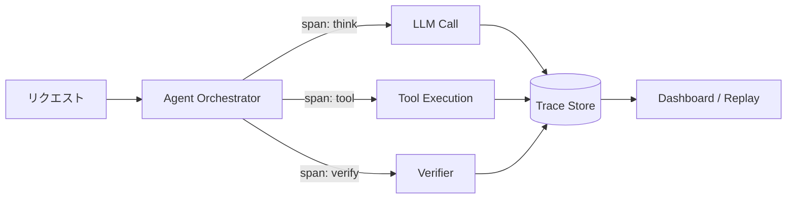

# #32 Agent Trace｜エージェントトレース

!!! abstract "一言"
    エージェントの全ステップ——思考・ツール呼び出し・応答——を**追記専用ログ**として記録し、あとから再生・監査できるようにする。

<!-- BEGIN:GEN:meta -->

メタデータ（機械可読） — #32 Agent Trace｜エージェントトレース

| 項目 | 値 |
|------|-----|
| **ID** | 32 |
| **カテゴリ** | 07-observability — 観測性・監査・評価 |
| **フォース** | `[F8]` |
| **ダイヤル** | trace-sampling-rate |
| **二者択一** | — |
| **関連パターン** | #54, #33, #35 |
| **向き** | マルチステップエージェント、規制監査、モデル/ツール組合せの複雑なシステム |
| **不向き** | 単一呼び出しステートレスAPI; 標準アプリログで十分 |
| **要素技術** | OpenTelemetry, Langfuse, LangSmith, Arize Phoenix, ClickHouse, BigQuery, S3+Parquet |

<!-- END:GEN:meta -->

## 概要

エージェントが誤った回答を返したとき、「なぜそうなったのか」を追跡できなければ改善のしようがない。どのツールを呼び、どんな中間結果を得て、最終回答に至ったのかを再構成できることが、本番運用では不可欠である。

このパターンでは、エージェントが1リクエストを処理する過程で踏むステップ（LLM呼び出し、ツール実行、内部判断）を、分散トレーシングのスパンとして追記専用ストアに書き出す。各スパンには入力・出力・レイテンシ・トークン数・モデルバージョンを付与し、セッション単位でツリー構造にまとめる。こうすることで「なぜその結果になったか」をあとから再構成でき、障害分析・コンプライアンス監査・品質改善の土台になる。

!!! info "意思決定上の位置づけ"
    - **必要にするフォース**: `[F8]` 説明責任・規制
    - **関与する決定**: [程度（ダイヤル）](../../decisions/tuning-dials.md) の トレースサンプリング率
    - **意思決定の進め方**: [意思決定の進め方](../../decisions/decision-flow.md)

## 設計

オーケストレータの各ステップがスパンを生成し、Trace Storeへ非同期に送出する。Trace Storeは追記専用（append-only）で、改竄に対する耐性を備えている。ダッシュボードやリプレイツールを通じてトレースを可視化し、フィルタリング・検索・集計を行える。

## 解決する課題

エージェントの出力は非決定論的であり、同じ入力でも異なる経路を辿ることがある。トレースがなければ「なぜ誤答したか」「どのツール呼び出しが遅延の原因か」を再現できず、改善が勘頼みになってしまう。また、規制業種では監査証跡が法的要件となる場合もあり `[F8]`、トレースはその基盤として欠かせない。

## 向き / 不向き

- **向き**: マルチステップのエージェントや、規制・コンプライアンス要件がある領域、複数モデル・ツールを組み合わせる構成に適している。
- **不向き**: 単発のステートレスな推論APIなど、1回のLLM呼び出しで完結し、通常のアプリケーションログで十分な場合には過剰になりやすい。

## 要素技術

- トレース基盤: OpenTelemetry、Langfuse、LangSmith、Arize Phoenix
- ストア: ClickHouse、BigQuery、S3 + Parquet（コールド層）
- 可視化: Grafana、Jaeger、各トレース基盤のUI

## 調整（程度）

- **記録粒度**（全トークン ⇔ 要約のみ）— 細かすぎるとストレージ・プライバシーコスト増 ⇔ 粗すぎると再現不能 / 決め手 `[F8]` / 目安: 規制業種はフル記録、社内ツールはメタデータ＋入出力要約。→ [程度ダイヤル](../../decisions/tuning-dials.md)

## 関連パターン

- [#54 Tiered Observability](54-tiered-observability.md) — トレースの保存先をホット／コールドに分けコストを最適化する
- [#33 Version Pinning](33-version-pinning.md) — トレースに記録するモデル・プロンプトのバージョンを固定する
- [#35 Production Replay](35-production-replay.md) — 記録したトレースを入力として新バージョンで再生・比較する

## 参考

- OpenTelemetry Semantic Conventions for GenAI
- Langfuse Documentation
