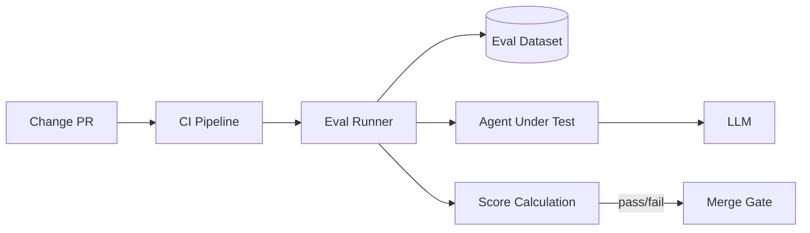

# #34 Evaluation CI/CD

!!! abstract "TL;DR"
    Run an **automated evaluation pipeline** on every prompt, model, or tool change to detect regressions before deployment.

<!-- BEGIN:GEN:meta -->

Metadata (machine-readable) — #34 Evaluation CI/CD

| Field | Value |
|------|-----|
| **ID** | 34 |
| **Category** | 07-observability — Observability, Auditing & Evaluation |
| **Forces** | `[F8]` |
| **Dials** | — |
| **Tradeoffs** | — |
| **Related Patterns** | #33, #35, #36 |
| **When to Use** | Weekly or more frequent prompt/model updates, quality SLAs, multi-person editing |
| **When Not to Use** | Early prototypes (premature cost); solo operator manual tuning |
| **Element Technologies** | promptfoo, Braintrust, Langfuse Eval, GitHub Actions, LLM-as-Judge |

<!-- END:GEN:meta -->

## Overview

Changing a single line in a prompt can break cases that previously worked correctly -- such regressions are a daily occurrence in agent development. Manual verification cannot keep up with coverage or reproducibility.

Just as traditional software CI/CD gates on unit and integration tests, agent changes should also pass through an evaluation (Eval) suite before merging. Specifically, you prepare evaluation datasets (inputs + expected outputs or judgment criteria), run them through the modified agent, and automatically measure accuracy, quality scores, latency, and cost. If results fall below thresholds, the merge is blocked, catching regressions before deployment.

!!! info "Position in decision-making"
    - **Driving force**: `[F8]` Accountability & Regulation
    - **Decision flow**: [Decision Flow](../../decisions/decision-flow.md)

## Design

When a PR is created, CI launches the evaluation runner. The evaluation runner feeds each case from the dataset to the Agent and scores the responses using methods such as LLM-as-Judge, rule-based evaluation, or human annotation. If scores fall below baseline, the PR is blocked.

## Problems Solved

Agent changes need to be evaluated by "behavioral quality" rather than "code correctness." Manual testing tends to lack coverage and reproducibility, and becomes unmanageable as release frequency increases. With an automated evaluation pipeline, you can mechanically detect regressions from even a single-line prompt change, ensuring the safety of changes `[F8]`.

## When to Use / When Not to Use

- **When to Use**: Teams updating prompts or models weekly or more frequently, products with quality SLAs, teams with multiple people editing prompts.
- **When Not to Use**: Early prototype stages where the cost of creating evaluation datasets does not justify the results.

## Element Technologies

- Evaluation frameworks: promptfoo, Braintrust, Langfuse Evaluations, OpenAI Evals
- Judgment methods: LLM-as-Judge, regex matching, embedding similarity, human annotation
- CI integration: GitHub Actions, GitLab CI, CircleCI

## Tuning (Dials)

- **Evaluation dataset size** — Too small leads to low reliability vs. too large increases CI time and cost / Deciding factor `[F8]` / Guideline: 50-500 cases, stratified sampling by importance. → [Tuning Dials](../../decisions/tuning-dials.md)

## Related Patterns

- [#33 Version Pinning](33-version-pinning.md) — Pin versions of evaluation targets to enable comparison
- [#35 Production Replay](35-production-replay.md) — Generate evaluation datasets from production logs
- [#36 Shadow / Canary Deployment](36-shadow-canary-deployment.md) — After passing CI evaluation, incrementally deploy to production

## References

- promptfoo Documentation
- Braintrust AI Eval Framework
