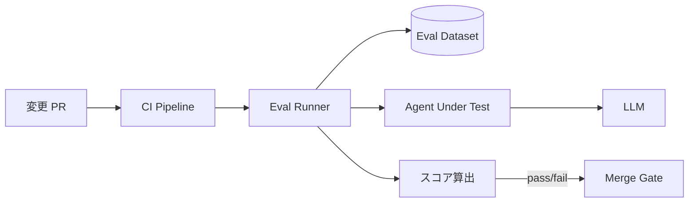

# #34 Evaluation CI/CD｜評価CI/CD

!!! abstract "一言"
    プロンプト・モデル・ツールの変更ごとに**自動評価パイプライン**を走らせ、回帰を検知してからデプロイする。

## 概要

従来のソフトウェアCI/CDがユニットテスト・結合テストでゲートするように、エージェントの変更もマージ前に評価（Eval）スイートを通過させる。評価データセット（入力＋期待出力または判定基準）を用意し、変更後のエージェントに流して正答率・品質スコア・レイテンシ・コストを自動計測する。閾値を下回ればマージをブロックし、回帰をデプロイ前に止める。

!!! info "意思決定上の位置づけ"
    - **必要にするフォース**: `[F8]` 説明責任・規制
    - **意思決定の進め方**: [意思決定の進め方](../../decisions/decision-flow.md)

## 設計

PRが作成されるとCIが評価ランナーを起動する。評価ランナーはデータセットの各ケースをAgentに投入し、応答をLLM-as-Judge・ルールベース判定・人間アノテーションで採点する。スコアがベースラインを下回ればPRをブロックする。

## 解決する課題

エージェントの変更は「コードの正しさ」ではなく「振る舞いの品質」で評価する必要がある。手動テストでは網羅性・再現性が不足し、リリース頻度が上がると破綻する。自動評価パイプラインがあれば、プロンプト1行の変更でも回帰を機械的に検知でき、変更の安全性が担保される `[F8]`。

## 向き / 不向き

- **向き**: 週次以上の頻度でプロンプト・モデルを更新するチーム、品質SLAがあるプロダクト、複数人でプロンプトを編集する体制。
- **不向き**: 評価データセットを作るコストが成果に見合わない初期プロトタイプ段階。

## 要素技術

- 評価フレームワーク: promptfoo、Braintrust、Langfuse Evaluations、OpenAI Evals
- 判定手法: LLM-as-Judge、正規表現マッチ、Embedding類似度、人間アノテーション
- CI統合: GitHub Actions、GitLab CI、CircleCI

## 調整（程度）

- **評価データセットの規模** — 少なすぎると信頼性不足 ⇔ 多すぎるとCI時間・コスト増 / 決め手 `[F8]` / 目安: 50〜500ケース、重要度別に層化サンプリング。→ [程度ダイヤル](../../decisions/tuning-dials.md)

## 関連パターン

- [#33 Version Pinning](33-version-pinning.md) — 評価対象のバージョンを固定し比較可能にする
- [#35 Production Replay](35-production-replay.md) — 本番ログから評価データセットを生成する
- [#36 Shadow / Canary Deployment](36-shadow-canary-deployment.md) — CI評価を通過した後、段階的に本番投入する

## 参考

- promptfoo Documentation
- Braintrust AI Eval Framework
