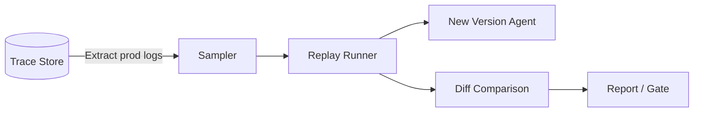

# #35 Production Replay

!!! abstract "TL;DR"
    **Replay traces recorded in production** through a new version of the agent and quantitatively compare differences with the old version.

<!-- BEGIN:GEN:meta -->

Metadata (machine-readable) — #35 Production Replay

| Field | Value |
|------|-----|
| **ID** | 35 |
| **Category** | 07-observability — Observability, Auditing & Evaluation |
| **Forces** | `[F8]`, `[F9]` |
| **Dials** | — |
| **Tradeoffs** | — |
| **Related Patterns** | #32, #34, #33, #36 |
| **When to Use** | Major model/prompt updates, provider switching, evaluation dataset staleness |
| **When Not to Use** | High masking cost for confidential PII; no trace history |
| **Element Technologies** | BigQuery/ClickHouse extraction, promptfoo/Braintrust replay, LLM-as-Judge, Presidio/DLP masking |

<!-- END:GEN:meta -->

## Overview

You want to upgrade a model or significantly rewrite a prompt -- but switching without knowing "what will change in production" is risky. Synthetic test data alone often cannot reproduce the diverse queries that actual users submit.

This pattern takes production traces (inputs, context, tool responses) accumulated by [#32 Agent Trace](32-agent-trace.md) and re-feeds them to an agent running with new prompts, models, and tool versions, then compares the output differences. The major advantage is the ability to evaluate the impact of changes against production-specific input distributions and edge cases beforehand.

!!! info "Position in decision-making"
    - **Driving force**: `[F8]` Accountability & Regulation, `[F9]` Provider Reliability
    - **Decision flow**: [Decision Flow](../../decisions/decision-flow.md)

## Design

First, the Sampler extracts evaluation targets from production traces (full or stratified sampling). Then the Replay Runner feeds user inputs and tool responses from the traces as stubs into the new Agent and obtains outputs. The diff comparison evaluates text similarity, quality scores, latency, and cost against the old outputs, passing results to a report or deploy gate.

## Problems Solved

Evaluation with synthetic data cannot sufficiently reflect production input distributions, leading to unexpected regressions discovered after release. Production replay, being based on real data, can predict "how things will change in production" with high accuracy. This enables quantifying the risk of model switching `[F9]` and prompt changes `[F8]` in advance.

## When to Use / When Not to Use

- **When to Use**: Before major model or prompt updates, for evaluating provider switches, when evaluation datasets have become stale over long-term operation.
- **When Not to Use**: When production traces contain PII or confidential data and masking costs are high. Systems without trace recording (introduce [#32 Agent Trace](32-agent-trace.md) first).

## Element Technologies

- Trace extraction: BigQuery, ClickHouse, S3 Select
- Replay: promptfoo replay mode, custom scripts, Braintrust Datasets
- Diff comparison: LLM-as-Judge, Embedding cosine distance, ROUGE/BERTScore
- PII processing: Presidio, Google DLP API

## Related Patterns

- [#32 Agent Trace](32-agent-trace.md) — Records the traces used as replay input
- [#34 Evaluation CI/CD](34-evaluation-ci-cd.md) — Incorporate replay results into CI pipeline gates
- [#33 Version Pinning](33-version-pinning.md) — Pin old and new versions to ensure accurate comparison
- [#36 Shadow / Canary Deployment](36-shadow-canary-deployment.md) — Proceed to canary if replay shows no issues

## References

- Braintrust Dataset-driven Evaluation
- promptfoo replay / dataset features
