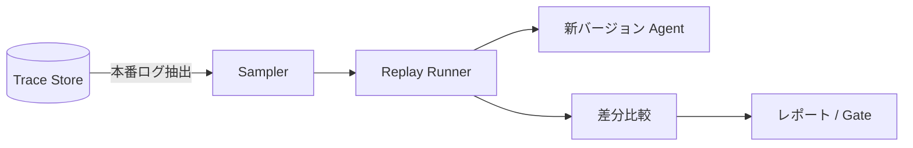

# #35 Production Replay｜本番リプレイ

!!! abstract "一言"
    本番で記録したトレースを**新バージョンのエージェントで再生**し、旧版との差分を定量比較する。

## 概要

[#32 Agent Trace](32-agent-trace.md) で蓄積した本番トレース（入力・コンテキスト・ツール応答）を、新しいプロンプト・モデル・ツールバージョンのエージェントに再投入し、出力の差分を比較する。合成テストデータでは再現しにくい本番特有の入力分布やエッジケースに対して、変更の影響を事前に評価できる。

## 設計

Samplerが本番トレースから評価対象を抽出する（全量または層化サンプリング）。Replay Runnerがトレース内のユーザー入力・ツール応答をスタブとして新Agentに投入し、出力を取得する。差分比較は旧出力とのテキスト類似度・品質スコア・レイテンシ・コストで行い、レポートまたはデプロイゲートに結果を渡す。

## 解決する課題

合成データによる評価では本番の入力分布を十分に反映できず、リリース後に予期しない回帰が発覚する。本番リプレイは実データに基づくため「本番でどう変わるか」を高い精度で予測でき、モデル切り替え `[F9]` やプロンプト変更のリスクを事前に定量化する `[F8]`。

## 向き / 不向き

- **向き**: モデルやプロンプトのメジャーアップデート前、プロバイダ切り替えの評価、長期運用で評価データセットが陳腐化した場合。
- **不向き**: 本番トレースにPII・機密が含まれマスキングコストが高い場合。トレース記録がそもそも無いシステム（先に [#32 Agent Trace](32-agent-trace.md) を導入する）。

## 要素技術

- トレース抽出: BigQuery、ClickHouse、S3 Select
- リプレイ: promptfoo replay mode、カスタムスクリプト、Braintrust Datasets
- 差分比較: LLM-as-Judge、Embedding cosine距離、ROUGE/BERTScore
- PII処理: Presidio、Google DLP API

## 関連パターン

- [#32 Agent Trace](32-agent-trace.md) — リプレイの入力となるトレースを記録する
- [#34 Evaluation CI/CD](34-evaluation-ci-cd.md) — リプレイ結果をCIパイプラインのゲートに組み込む
- [#33 Version Pinning](33-version-pinning.md) — 旧版・新版のバージョンを固定し比較を正確にする
- [#36 Shadow / Canary Deployment](36-shadow-canary-deployment.md) — リプレイで問題なければカナリアへ進む

## 参考

- Braintrust Dataset-driven Evaluation
- promptfoo replay / dataset 機能
