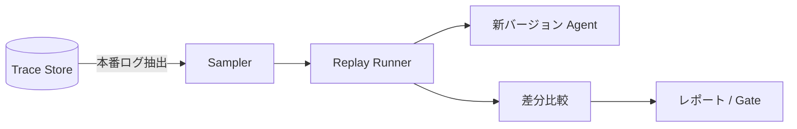

# #35 Production Replay｜本番リプレイ

!!! abstract "一言"
    本番で記録したトレースを**新バージョンのエージェントで再生**し、旧版との差分を定量比較します。

<!-- BEGIN:GEN:meta -->

メタデータ（機械可読） — #35 Production Replay｜本番リプレイ

| 項目 | 値 |
|------|-----|
| **ID** | 35 |
| **カテゴリ** | 07-observability — 観測性・監査・評価 |
| **フォース** | `[F8]`, `[F9]` |
| **ダイヤル** | — |
| **二者択一** | — |
| **関連パターン** | #32, #34, #33, #36 |
| **向き** | 大規模モデル/プロンプト更新、プロバイダ切替、評価データセットの陳腐化 |
| **不向き** | 機密PIIの高マスクコスト; トレース履歴なし |
| **要素技術** | BigQuery/ClickHouse抽出, promptfoo/Braintrust replay, LLM-as-Judge, Presidio/DLP マスキング |

<!-- END:GEN:meta -->

## 概要

モデルをアップグレードしたい、プロンプトを大幅に書き換えたい――しかし「本番で何が変わるのか」が分からないまま切り替えるのは怖いものです。合成テストデータだけでは、実際のユーザーが投げてくる多様なクエリを再現しきれないことも多くあります。

本パターンでは、[#32 Agent Trace](32-agent-trace.md) で蓄積した本番トレース（入力・コンテキスト・ツール応答）を、新しいプロンプト・モデル・ツールバージョンのエージェントに再投入し、出力の差分を比較します。本番特有の入力分布やエッジケースに対して変更の影響を事前に評価できるのが大きな利点です。

!!! info "意思決定上の位置づけ"
    - **必要にするフォース**: `[F8]` 説明責任・規制・`[F9]` プロバイダ信頼度
    - **意思決定の進め方**: [意思決定の進め方](../../decisions/decision-flow.md)

## 設計

まずSamplerが本番トレースから評価対象を抽出します（全量または層化サンプリング）。次にReplay Runnerがトレース内のユーザー入力・ツール応答をスタブとして新Agentに投入し、出力を取得します。差分比較では旧出力とのテキスト類似度・品質スコア・レイテンシ・コストを評価し、その結果をレポートまたはデプロイゲートに渡します。

## 解決する課題

合成データによる評価では本番の入力分布を十分に反映できず、リリース後に予期しない回帰が発覚することがあります。一方、本番リプレイは実データに基づくため「本番でどう変わるか」を高い精度で予測できます。これにより、モデル切り替え `[F9]` やプロンプト変更のリスクを事前に定量化できます `[F8]`。

## 向き / 不向き

- **向き**: モデルやプロンプトのメジャーアップデート前、プロバイダ切り替えの評価、長期運用で評価データセットが陳腐化した場合に適しています。
- **不向き**: 本番トレースにPII・機密が含まれマスキングコストが高い場合には不向きです。トレース記録がそもそも無いシステムでは、先に [#32 Agent Trace](32-agent-trace.md) を導入してください。

## 要素技術

- トレース抽出: BigQuery、ClickHouse、S3 Select
- リプレイ: promptfoo replay mode、カスタムスクリプト、Braintrust Datasets
- 差分比較: LLM-as-Judge、Embedding cosine距離、ROUGE/BERTScore
- PII処理: Presidio、Google DLP API

## 関連パターン

- [#32 Agent Trace](32-agent-trace.md) — リプレイの入力となるトレースを記録する
- [#34 Evaluation CI/CD](34-evaluation-ci-cd.md) — リプレイ結果をCIパイプラインのゲートに組み込む
- [#33 Version Pinning](33-version-pinning.md) — 旧版・新版のバージョンを固定し比較を正確にする
- [#36 Shadow / Canary Deployment](36-shadow-canary-deployment.md) — リプレイで問題なければカナリアへ進む

## 参考

- Braintrust Dataset-driven Evaluation
- promptfoo replay / dataset 機能
