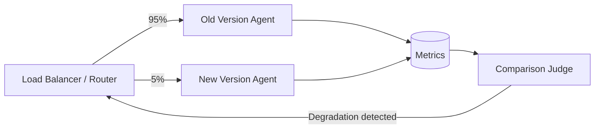

# #36 Shadow / Canary Deployment

!!! abstract "TL;DR"
    Incrementally deploy a new version to **only a portion of production traffic**, with automatic rollback on metric degradation.

<!-- BEGIN:GEN:meta -->

Metadata (machine-readable) — #36 Shadow / Canary Deployment

| Field | Value |
|------|-----|
| **ID** | 36 |
| **Category** | 07-observability — Observability, Auditing & Evaluation |
| **Forces** | `[F9]` |
| **Dials** | — |
| **Tradeoffs** | — |
| **Related Patterns** | #34, #35, #33 |
| **When to Use** | Sufficient production volume, strict SLAs, model upgrades/major prompt revisions |
| **When Not to Use** | Low request volume; complex read-only mocking for side effects; uniform task distribution |
| **Element Technologies** | Envoy/Istio/ALB weighted routing, LaunchDarkly, Datadog/Prometheus, Argo Rollouts, Flagger |

<!-- END:GEN:meta -->

## Overview

Just because a version passed evaluation CI does not mean it is safe to roll out to all users at once. Edge cases not covered by offline evaluation may surface in production, impacting all users -- a scenario you want to avoid.

This pattern uses shadow mode (duplicating production requests to the new version for processing without returning results to users) or canary mode (routing only a portion of traffic to the new version) for incremental rollout, while monitoring quality, latency, and cost metrics. If degradation exceeding thresholds is detected, an automatic rollback is triggered.

!!! info "Position in decision-making"
    - **Driving force**: `[F9]` Provider Reliability
    - **Decision flow**: [Decision Flow](../../decisions/decision-flow.md)

## Design

The router distributes traffic between old and new versions with weighted routing. Metrics from both (accuracy, latency p50/p99, token cost, error rate) are collected in the same infrastructure and compared statistically. If significant degradation is detected, routing to the new version is reverted to 0%. If no issues arise, the ratio is gradually increased until reaching 100%.

## Problems Solved

Agents are non-deterministic, and offline evaluation alone cannot cover all production patterns. Full deployment risks quality degradation affecting all users, but incremental rollout limits the blast radius `[F9]`. It also enables early detection and rollback against unexpected behavioral changes from provider-side model updates.

## When to Use / When Not to Use

- **When to Use**: Services with sufficient production traffic for statistical comparison, services with strict SLAs, during model switches or major prompt revisions.
- **When Not to Use**: When request volume is too low for statistical significance, or when shadow execution of side-effect operations would cause duplicate writes (side effects must be mocked during shadow mode).

## Element Technologies

- Routing: Envoy, Istio, AWS ALB weighted target groups, LaunchDarkly
- Metrics comparison: Datadog, Grafana + Prometheus, custom statistical test scripts
- Rollback: Argo Rollouts, Flagger, AWS CodeDeploy

## Selection (Tradeoffs)

- **Shadow vs. Canary** — Depends on presence of side effects and risk tolerance `[F9]`. Shadow is safer for read-only operations without side effects. Use canary (starting at low percentage) when you need to assess quality with real users despite side effects. → [Tradeoff Selection Criteria](../../decisions/tradeoffs.md)

## Related Patterns

- [#34 Evaluation CI/CD](34-evaluation-ci-cd.md) — Pre-screen with offline evaluation before canary deployment
- [#35 Production Replay](35-production-replay.md) — Evaluate the new version using past logs as an alternative to shadow
- [#33 Version Pinning](33-version-pinning.md) — Clearly distinguish between old and new versions

## References

- Argo Rollouts Progressive Delivery
- Google SRE Book — Release Engineering
