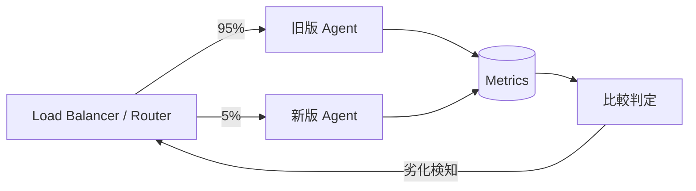

# #36 Shadow / Canary Deployment｜シャドー／カナリア

!!! abstract "一言"
    新バージョンを**本番トラフィックの一部**にだけ段階的に投入し、メトリクス悪化で自動ロールバックする。

## 概要

エージェントの変更（プロンプト・モデル・ツール）は、評価CIを通過しても、本番の全トラフィックに一括適用するとリスクが高い。本パターンでは、シャドーモード（本番リクエストを複製して新版で処理するが、結果はユーザーに返さない）またはカナリアモード（トラフィックの一部だけを新版に振る）により段階的に投入し、品質・レイテンシ・コストのメトリクスを監視する。閾値を超えた劣化を検知した場合は自動でロールバックする。

!!! info "意思決定上の位置づけ"
    - **必要にするフォース**: `[F9]` プロバイダ信頼度
    - **意思決定の進め方**: [意思決定の進め方](../../decisions/decision-flow.md)

## 設計

ルーターがトラフィックを旧版と新版に重み付きで振り分ける。両者のメトリクス（正答率、レイテンシp50/p99、トークンコスト、エラー率）を同一基盤で収集し、統計的に比較する。有意な劣化が検知された場合は、新版への振り分けを0%に戻す。問題がなければ徐々に比率を上げていき、最終的に100%へ切り替える。

## 解決する課題

エージェントは非決定論的であり、オフライン評価だけでは本番の全パターンをカバーしきれない。一括デプロイでは品質劣化が全ユーザーに波及するおそれがあるが、段階投入によって被害半径を限定できる `[F9]`。また、プロバイダ側のモデル更新による不意の挙動変化に対しても、カナリアで早期検知・ロールバックが可能になる。

## 向き / 不向き

- **向き**: 本番トラフィックが十分にあり統計的比較が成立する規模、SLAが厳しいサービス、モデル切り替えやプロンプト大改修時。
- **不向き**: リクエスト数が少なく統計的有意差が出ない場合や、副作用のある処理でシャドー実行するとデータの二重書きが起きる場合（シャドー時は副作用をモックする必要がある）。

## 要素技術

- ルーティング: Envoy、Istio、AWS ALB weighted target groups、LaunchDarkly
- メトリクス比較: Datadog、Grafana + Prometheus、カスタム統計検定スクリプト
- ロールバック: Argo Rollouts、Flagger、AWS CodeDeploy

## 選定（相反）

- **シャドー ↔ カナリア** — 副作用の有無とリスク許容度 `[F9]`。副作用がないread系はシャドーが安全。副作用ありでも実ユーザーでの品質を見たい場合はカナリア（低比率から）。→ [相反の選定基準](../../decisions/tradeoffs.md)

## 関連パターン

- [#34 Evaluation CI/CD](34-evaluation-ci-cd.md) — カナリア投入前にオフライン評価で足切りする
- [#35 Production Replay](35-production-replay.md) — シャドーの代替として過去ログで新版を評価する
- [#33 Version Pinning](33-version-pinning.md) — 旧版・新版のバージョンを明確に区別する

## 参考

- Argo Rollouts Progressive Delivery
- Google SRE Book — Release Engineering
