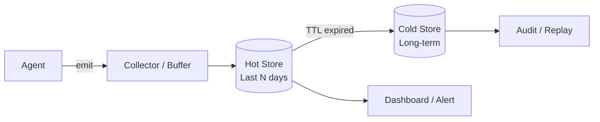

# #54 Tiered (Hot/Cold) Observability

!!! abstract "TL;DR"
    Split observability data into a **hot tier (fast) and cold tier (cheap)** to balance real-time capability with cost.

<!-- BEGIN:GEN:meta -->

Metadata (machine-readable) — #54 Tiered (Hot/Cold) Observability

| Field | Value |
|------|-----|
| **ID** | 54 |
| **Category** | 07-observability — Observability, Auditing & Evaluation |
| **Forces** | `[F8]`, `[F7]` |
| **Dials** | trace-sampling-rate, log-retention |
| **Tradeoffs** | — |
| **Related Patterns** | #32, #35, #33 |
| **When to Use** | High-traffic agent systems, regulatory long-term retention, cost optimization priority |
| **When Not to Use** | Low traffic where a single tier suffices; ultra-fast cold access required |
| **Element Technologies** | ClickHouse, Elasticsearch, Prometheus, S3+Parquet, BigQuery, Glacier, lifecycle policies |

<!-- END:GEN:meta -->

## Overview

Keeping all agent traces in a real-time searchable database causes storage costs to skyrocket at the scale of millions of monthly requests. On the other hand, moving everything to object storage makes it impossible to quickly respond to "I want to see traces from the last hour" during an incident.

Tiered observability retains recent data (hours to days) in the hot tier for real-time alerts and dashboards, while automatically migrating older data to the cold tier for long-term storage and auditing.

!!! info "Position in decision-making"
    - **Driving force**: `[F8]` Accountability & Regulation, `[F7]` Cost Sensitivity & Scale
    - **Related decision**: Trace sampling rate and log retention period in [Tuning Dials](../../decisions/tuning-dials.md)
    - **Decision flow**: [Decision Flow](../../decisions/decision-flow.md)

## Design

The Collector receives data and writes it to the hot tier (time-series DB / search engine). Based on TTL policies, expired data is migrated from the hot tier to the cold tier (object storage + columnar DB). When auditing or replay is needed, data is retrieved from the cold tier via batch queries.

## Problems Solved

A single agent request can generate dozens of spans and thousands of tokens of logs. At the scale of millions of monthly requests, keeping everything in a real-time DB causes storage costs to balloon by several to tens of times `[F7]`. At the same time, regulatory requirements may mandate retention for several years `[F8]`. The two-tier architecture elegantly resolves this contradiction.

## When to Use / When Not to Use

- **When to Use**: High-traffic agent systems, regulated domains requiring long-term auditing, operations where cost optimization is a priority.
- **When Not to Use**: Low-traffic environments where a single store suffices -- the two-tier approach becomes over-engineering.

## Element Technologies

- Hot tier: ClickHouse, Elasticsearch, Prometheus + Grafana
- Cold tier: S3 / GCS + Parquet, BigQuery (long-term storage), Glacier
- Migration: Lifecycle Policy (S3), Retention Policy (ClickHouse TTL)

## Tuning (Dials)

- **Hot tier retention period** — Too short hinders incident investigation vs. too long increases cost / Deciding factors `[F7]` `[F8]` / Guideline: 3-14 days. → [Tuning Dials](../../decisions/tuning-dials.md)

## Related Patterns

- [#32 Agent Trace](32-agent-trace.md) — Generates the trace data stored across two tiers
- [#35 Production Replay](35-production-replay.md) — Uses cold tier data for production log replay
- [#33 Version Pinning](33-version-pinning.md) — Attaches version information to traces for tracking even in the cold tier

## References

- Grafana Mimir / Loki retention policy design
- AWS S3 Intelligent-Tiering
