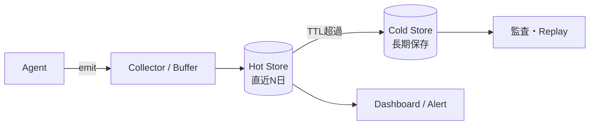

# #54 Tiered (Hot/Cold) Observability｜二層観測

!!! abstract "一言"
    観測データを**高速層（Hot）と安価層（Cold）**に二分し、リアルタイム性とコストを両立させる。

## 概要

エージェントが生成するトレース・メトリクス・ログは大量かつ高頻度になる。全データを高速クエリ可能なストアに保持するとコストが爆発する一方、全てをコールドストレージに落とすとインシデント対応が遅れる。二層観測では直近データ（数時間〜数日）をHot層に保持してリアルタイムのアラート・ダッシュボードに使い、古いデータはCold層へ自動移行して長期保存・監査用途に備える。

!!! info "意思決定上の位置づけ"
    - **必要にするフォース**: `[F8]` 説明責任・規制・`[F7]` コスト感度・スケール
    - **関与する決定**: [程度（ダイヤル）](../../decisions/tuning-dials.md) の トレースサンプリング率・ログ保持期間
    - **意思決定の進め方**: [意思決定の進め方](../../decisions/decision-flow.md)

## 設計

Collectorがデータを受け取り、まずHot層（時系列DB・検索エンジン）へ書き込む。TTLポリシーに基づきHot層から期限切れデータをCold層（オブジェクトストレージ＋カラムナDB）へ移行する。監査やリプレイ時にはCold層からバッチクエリで取得する。

## 解決する課題

エージェント1リクエストあたり数十スパン・数千トークンのログが生まれる。月間数百万リクエストの規模では、全てをリアルタイムDBに置くストレージ費用が数倍〜数十倍に膨らむ `[F7]`。一方、規制要件で数年間の保持が必要な場合もある `[F8]`。二層構成はこの矛盾を解消する。

## 向き / 不向き

- **向き**: 高トラフィックなエージェントシステム、長期監査が必要な規制領域、コスト最適化が求められる運用。
- **不向き**: トラフィックが少なく単一ストアで十分な規模（過剰設計になる）。

## 要素技術

- Hot層: ClickHouse、Elasticsearch、Prometheus + Grafana
- Cold層: S3 / GCS + Parquet、BigQuery（長期ストレージ）、Glacier
- 移行: Lifecycle Policy（S3）、Retention Policy（ClickHouse TTL）

## 調整（程度）

- **Hot層の保持期間** — 短すぎるとインシデント調査に支障 ⇔ 長すぎるとコスト増 / 決め手 `[F7]` `[F8]` / 目安: 3〜14日。→ [程度ダイヤル](../../decisions/tuning-dials.md)

## 関連パターン

- [#32 Agent Trace](32-agent-trace.md) — 二層に保存するトレースデータそのものを生成する
- [#35 Production Replay](35-production-replay.md) — Cold層のデータを使って本番ログを再生する
- [#33 Version Pinning](33-version-pinning.md) — バージョン情報をトレースに付与し、Cold層でも追跡可能にする

## 参考

- Grafana Mimir / Loki のリテンションポリシー設計
- AWS S3 Intelligent-Tiering
