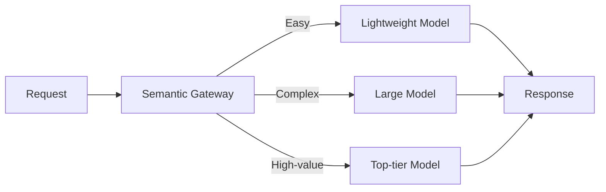

# #37 Semantic Gateway & Cost-Aware Router

!!! abstract "TL;DR"
    **Dynamically select models** based on request difficulty and value to optimize the balance between quality and cost.

<!-- BEGIN:GEN:meta -->

Metadata (machine-readable) — #37 Semantic Gateway & Cost-Aware Router

| Field | Value |
|------|-----|
| **ID** | 37 |
| **Category** | 08-cost-scaling — Cost, Performance & Scaling |
| **Forces** | `[F7]`, `[F3]` |
| **Dials** | model-tier-routing |
| **Tradeoffs** | — |
| **Related Patterns** | #56, #40, #38 |
| **When to Use** | Wide difficulty distribution (70% easy, 30% complex), monthly cost caps |
| **When Not to Use** | Uniform difficulty distribution; low tolerance for misrouting |
| **Element Technologies** | Martian, Unify, OpenRouter, small LLM/fasttext classifiers, LiteLLM, Helicone |

<!-- END:GEN:meta -->

## Overview

There is no need to process "What's the weather today?" and a complex legal document summary with the same top-tier model. However, sending all requests to a large model causes API costs to grow linearly, while routing everything to a cheap model degrades quality for complex tasks.

A semantic gateway receives requests and routes them to the optimal model based on difficulty classification, value estimation, and cost constraints. Simple questions get instant answers from lightweight models, while complex reasoning is sent to large models. This significantly reduces average cost while maintaining quality.

!!! info "Position in decision-making"
    - **Driving force**: `[F7]` Cost Sensitivity & Scale, `[F3]` Per-Request Value
    - **Related decision**: Model tier in [Tuning Dials](../../decisions/tuning-dials.md)
    - **Decision flow**: [Decision Flow](../../decisions/decision-flow.md)

## Design

The gateway uses a lightweight classifier (small LLM, rule-based, embedding classification) to assess request difficulty, cross-referencing it with a cost budget table to select the model. The classifier itself must have low cost and latency. As a safeguard against misclassification, the design also includes a fallback to retry with a higher-tier model if response quality is low.

## Problems Solved

Large model API costs can be 10-50x per token compared to small models. Sending all requests to large models causes monthly costs to scale linearly `[F7]`. Conversely, using only small models degrades quality for high-value requests `[F3]`. Dynamic routing continuously optimizes this tradeoff.

## When to Use / When Not to Use

- **When to Use**: Services with a wide request difficulty distribution (e.g., 70% easy, 30% complex), products with monthly cost caps.
- **When Not to Use**: When all requests have equal complexity and importance, routing overhead is wasted. Also unsuitable when classifier accuracy is low and misrouting is frequent.

## Element Technologies

- Router: Martian, Unify, OpenRouter, custom gateway
- Classifier: Small LLM, fasttext, Embedding + threshold
- Cost management: LiteLLM, Helicone

## Tuning (Dials)

- **Classification threshold** — Too low causes excessive routing to large models increasing cost vs. too high causes quality degradation / Deciding factors `[F7]` `[F3]` / Guideline: Continuously monitor classification accuracy and cost reduction rate against production metrics. → [Tuning Dials](../../decisions/tuning-dials.md)

## Selection (Tradeoffs)

- **Single high-performance model vs. dynamic routing** — Whether the variance in request difficulty is large enough and cost savings exceed classifier costs `[F7]` `[F3]`. → [Tradeoff Selection Criteria](../../decisions/tradeoffs.md)

## Related Patterns

- [#56 Adaptive Effort](56-adaptive-effort.md) — Adjusts not just model selection but also reasoning step count and token count by difficulty
- [#40 Fallback & Graceful Degradation](40-fallback-graceful-degradation.md) — Falls back when the selected model fails
- [#38 Semantic Result Cache](38-semantic-result-cache.md) — A cache hit before routing can skip the model call entirely

## References

- OpenRouter Model Routing
- Martian Model Router
