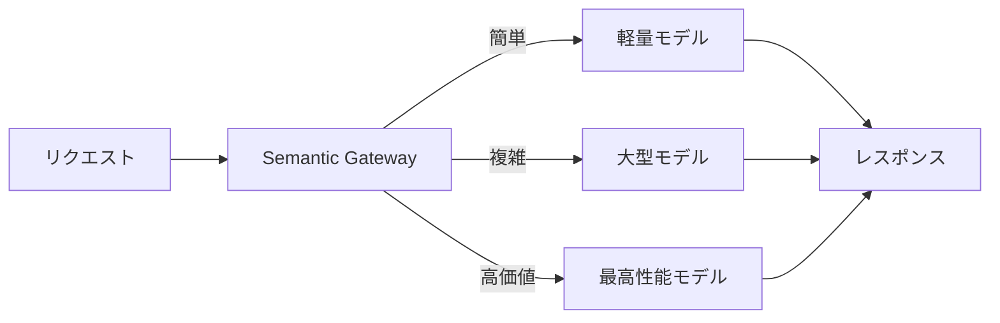

# #37 Semantic Gateway & Cost-Aware Router｜動的ルーティング

!!! abstract "一言"
    リクエストの難易度・価値に応じて**モデルを動的に選択**し、品質とコストを最適化する。

## 概要

全てのリクエストを最高性能（＝最高コスト）のモデルに送る必要はない。セマンティックゲートウェイはリクエストを受け取り、難易度分類・価値推定・コスト制約を基に最適なモデルへルーティングする。単純な質問は軽量モデルで即答し、複雑な推論は大型モデルへ送る。これにより、平均コストを大幅に下げつつ品質を維持できる。

!!! info "意思決定上の位置づけ"
    - **必要にするフォース**: `[F7]` コスト感度・スケール・`[F3]` 1リクエストの価値
    - **関与する決定**: [程度（ダイヤル）](../../decisions/tuning-dials.md) の モデル階層
    - **意思決定の進め方**: [意思決定の進め方](../../decisions/decision-flow.md)

## 設計

ゲートウェイはリクエストを軽量な分類器（小型LLM、ルールベース、Embedding分類）で難易度判定し、コスト予算テーブルと照合してモデルを選定する。分類器自体のコスト・レイテンシが低いことが前提であり、分類ミスのフォールバック（回答品質が低ければ上位モデルで再試行）も設計に含める。

## 解決する課題

大型モデルのAPI費用はトークン単価が小型の10〜50倍に達する。全リクエストを大型モデルに送ると月額コストが線形に膨張し `[F7]`、一方で全てを小型モデルにすると高価値リクエストの品質が低下する `[F3]`。動的ルーティングはこのトレードオフを連続的に最適化する。

## 向き / 不向き

- **向き**: リクエストの難易度分布に幅がある（簡単7割・複雑3割など）サービス、月間コストに上限があるプロダクト。
- **不向き**: 全リクエストが同等の複雑さ・重要度を持つ場合（ルーティングのオーバーヘッドが無駄になる）。分類器の精度が低く誤ルーティングが頻発する場合。

## 要素技術

- ルーター: Martian、Unify、OpenRouter、カスタムゲートウェイ
- 分類器: 小型LLM、fasttext、Embedding + 閾値
- コスト管理: LiteLLM、Helicone

## 調整（程度）

- **分類閾値** — 低すぎると大型モデルへの流入過多でコスト増 ⇔ 高すぎると品質劣化 / 決め手 `[F7]` `[F3]` / 目安: 本番メトリクスで分類精度とコスト削減率を継続モニタリング。→ [程度ダイヤル](../../decisions/tuning-dials.md)

## 選定（相反）

- **単一高性能モデル ↔ 動的ルーティング** — リクエスト難易度の分散が大きく、コスト削減効果が分類器コストを上回るか `[F7]` `[F3]`。→ [相反の選定基準](../../decisions/tradeoffs.md)

## 関連パターン

- [#56 Adaptive Effort](56-adaptive-effort.md) — モデル選択だけでなく推論ステップ数・トークン数も難易度で調整する
- [#40 Fallback & Graceful Degradation](40-fallback-graceful-degradation.md) — 選択したモデルが障害時にフォールバックする
- [#38 Semantic Result Cache](38-semantic-result-cache.md) — ルーティング前にキャッシュヒットすればモデル呼び出し自体を省く

## 参考

- OpenRouter Model Routing
- Martian Model Router
