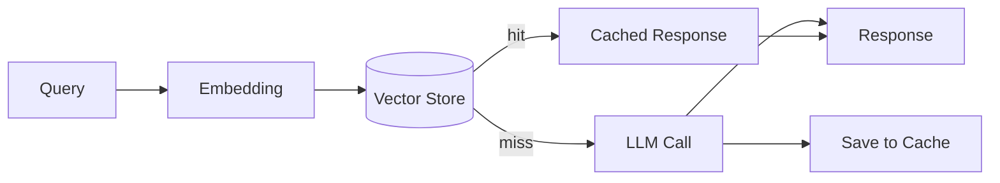

# #38 Semantic Result Cache

!!! abstract "TL;DR"
    Search past responses by **semantic similarity** and reuse them for sufficiently similar queries without calling the LLM.

<!-- BEGIN:GEN:meta -->

Metadata (machine-readable) — #38 Semantic Result Cache

| Field | Value |
|------|-----|
| **ID** | 38 |
| **Category** | 08-cost-scaling — Cost, Performance & Scaling |
| **Forces** | `[F4]`, `[F7]` |
| **Dials** | cache-similarity |
| **Tradeoffs** | — |
| **Related Patterns** | #39, #37, #24 |
| **When to Use** | Repetitive FAQ-like queries, customer support, document search |
| **When Not to Use** | Context-dependent (user state, real-time); freshness-critical (stock prices, news) |
| **Element Technologies** | OpenAI/Cohere Embedding, Redis VSS, Pinecone, pgvector, GPTCache, LangChain SemanticCache |

<!-- END:GEN:meta -->

## Overview

Customer support agents receive repeated similar questions like "How much is shipping?" or "What's the return process?" The wording varies slightly each time, so exact-match caching misses, but semantically they are nearly identical -- calling the LLM every time wastes cost and latency.

A semantic result cache converts queries to embeddings and returns past responses if vector similarity exceeds a threshold. By skipping the LLM call, both latency and cost are reduced. On cache miss, the LLM is called normally and the result is added to the cache.

!!! info "Position in decision-making"
    - **Driving force**: `[F4]` Latency Budget, `[F7]` Cost Sensitivity & Scale
    - **Related decision**: Cache similarity threshold in [Tuning Dials](../../decisions/tuning-dials.md)
    - **Decision flow**: [Decision Flow](../../decisions/decision-flow.md)

## Design

The query's embedding is used for nearest-neighbor search in the vector store. If similarity is above the threshold and within TTL, the cached response is returned. On miss, the LLM is called and the response-embedding pair is written to the store.

## Problems Solved

For workloads with repeated synonymous or similar queries, calling the LLM every time is wasteful in terms of both cost `[F7]` and latency `[F4]`. Introducing a semantic cache reduces LLM call frequency, significantly improving response speed as well.

## When to Use / When Not to Use

- **When to Use**: Customer support, document search, internal knowledge bases, and other domains with frequent repetitive FAQ-like queries.
- **When Not to Use**: Responses that depend on per-query unique context (user state, real-time data), or freshness-critical domains like news and stock prices. Also unsuitable when the semantic similarity judgment is inaccurate and the risk of returning incorrect responses cannot be tolerated.

## Element Technologies

- Embedding: OpenAI Embeddings, Cohere Embed, SentenceTransformers
- Vector store: Redis VSS, Pinecone, Weaviate, pgvector
- Cache infrastructure: GPTCache, LangChain SemanticCache

## Tuning (Dials)

- **Similarity threshold** — Too low causes false hits (returning old responses for semantically different queries) vs. too high reduces hit rate / Deciding factors `[F4]` `[F7]` / Guideline: cosine similarity 0.92-0.97 (adjust per domain). → [Tuning Dials](../../decisions/tuning-dials.md)
- **TTL** — Too short reduces hit rate vs. too long returns stale information / Deciding factor: data freshness requirements / Guideline: 1 hour to 7 days. → [Tuning Dials](../../decisions/tuning-dials.md)

## Related Patterns

- [#39 Prompt Cache Optimized Context](39-prompt-cache-optimized-context.md) — Reduces token cost via LLM-side prompt caching (complementary to result caching)
- [#37 Semantic Gateway](37-semantic-gateway-cost-aware-router.md) — Optimizes model selection on cache miss
- [#24 Context Pack / Assembly](../05-memory-context/24-context-pack-assembly.md) — Design decision on whether to include context in the cache key

## References

- GPTCache Documentation
- Redis Vector Similarity Search
