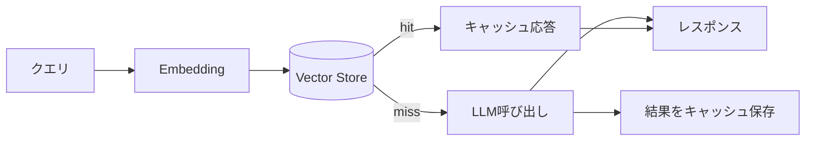

# #38 Semantic Result Cache｜セマンティック結果キャッシュ

!!! abstract "一言"
    過去の応答を**意味的類似度**で検索し、十分に近いクエリにはLLMを呼ばず再利用する。

<!-- BEGIN:GEN:meta -->

メタデータ（機械可読） — #38 Semantic Result Cache｜セマンティック結果キャッシュ

| 項目 | 値 |
|------|-----|
| **ID** | 38 |
| **カテゴリ** | 08-cost-scaling — コスト・性能・スケーリング |
| **フォース** | `[F4]`, `[F7]` |
| **ダイヤル** | cache-similarity |
| **二者択一** | — |
| **関連パターン** | #39, #37, #24 |
| **向き** | 繰り返しFAQ的クエリ、カスタマーサポート、ドキュメント検索 |
| **不向き** | コンテキスト依存（ユーザー状態、リアルタイム）; 鮮度重視（株価・ニュース） |
| **要素技術** | OpenAI/Cohere Embedding, Redis VSS, Pinecone, pgvector, GPTCache, LangChain SemanticCache |

<!-- END:GEN:meta -->

## 概要

カスタマーサポートのエージェントには「送料はいくら？」「返品の手続きは？」といった類似の質問が繰り返し寄せられる。表現は毎回微妙に異なるため完全一致キャッシュではヒットしないが、意味的にはほぼ同じであり、毎回LLMを呼ぶのはコストとレイテンシの無駄である。

セマンティック結果キャッシュはクエリをEmbeddingに変換し、ベクトル類似度が閾値を超える過去の応答があればそれを返す仕組みである。LLM呼び出しを省略できるため、レイテンシとコストの両方を削減できる。キャッシュミス時は通常通りLLMを呼び、結果をキャッシュに追加する。

!!! info "意思決定上の位置づけ"
    - **必要にするフォース**: `[F4]` レイテンシ予算・`[F7]` コスト感度・スケール
    - **関与する決定**: [程度（ダイヤル）](../../decisions/tuning-dials.md) の キャッシュ類似度閾値
    - **意思決定の進め方**: [意思決定の進め方](../../decisions/decision-flow.md)

## 設計

クエリのEmbeddingをベクトルストアで近傍検索する。類似度が閾値以上かつTTL内であればキャッシュヒットとして応答を返す。ミス時はLLMを呼び、応答とEmbeddingをペアでストアに書き込む。

## 解決する課題

同義・類似のクエリが繰り返されるワークロードでは、毎回LLMを呼ぶのはコスト `[F7]` とレイテンシ `[F4]` の面で無駄が多い。セマンティックキャッシュを導入すればLLM呼び出し回数を減らせるため、応答速度も大幅に改善できる。

## 向き / 不向き

- **向き**: FAQ的な繰り返しクエリが多いカスタマーサポート、ドキュメント検索、社内ナレッジベースなど。
- **不向き**: クエリごとに固有のコンテキスト（ユーザー状態、リアルタイムデータ）に依存する応答や、鮮度が重要なニュース・株価などには向かない。また、キャッシュの意味的類似判定が不正確で、誤った応答を返すリスクが許容できない場合にも適さない。

## 要素技術

- Embedding: OpenAI Embeddings、Cohere Embed、SentenceTransformers
- ベクトルストア: Redis VSS、Pinecone、Weaviate、pgvector
- キャッシュ基盤: GPTCache、LangChain SemanticCache

## 調整（程度）

- **類似度閾値** — 低すぎると誤ヒット（意味が異なるクエリに古い応答を返す）⇔ 高すぎるとヒット率低下 / 決め手 `[F4]` `[F7]` / 目安: cosine similarity 0.92〜0.97（ドメインで調整）。→ [程度ダイヤル](../../decisions/tuning-dials.md)
- **TTL** — 短すぎるとヒット率低下 ⇔ 長すぎると古い情報を返す / 決め手: データの鮮度要件 / 目安: 1時間〜7日。→ [程度ダイヤル](../../decisions/tuning-dials.md)

## 関連パターン

- [#39 Prompt Cache Optimized Context](39-prompt-cache-optimized-context.md) — LLM側のプロンプトキャッシュでトークンコストを削減する（結果キャッシュと補完関係）
- [#37 Semantic Gateway](37-semantic-gateway-cost-aware-router.md) — キャッシュミス時のモデル選択を最適化する
- [#24 Context Pack / Assembly](../05-memory-context/24-context-pack-assembly.md) — キャッシュキーにコンテキストを含めるか否かの設計判断

## 参考

- GPTCache Documentation
- Redis Vector Similarity Search
