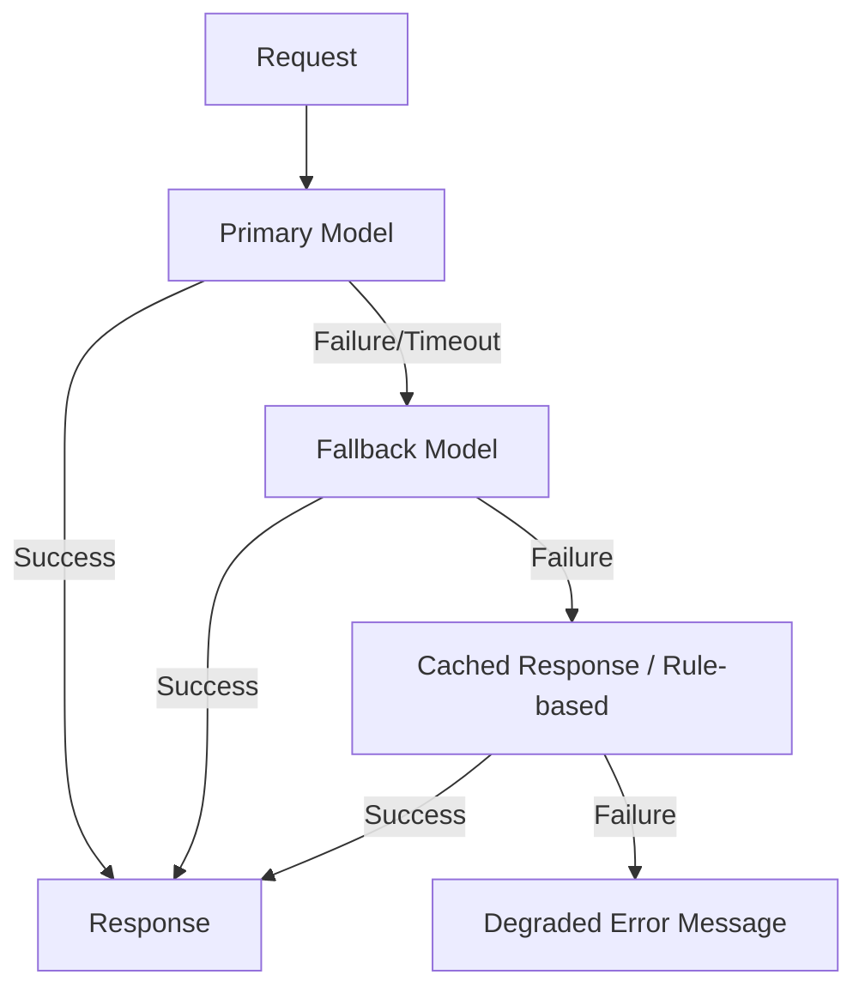

# #40 Fallback & Graceful Degradation

!!! abstract "TL;DR"
    **Gradually degrade** during LLM provider or tool failures to maintain service continuity.

<!-- BEGIN:GEN:meta -->

Metadata (machine-readable) — #40 Fallback & Graceful Degradation

| Field | Value |
|------|-----|
| **ID** | 40 |
| **Category** | 08-cost-scaling — Cost, Performance & Scaling |
| **Forces** | `[F9]` |
| **Dials** | retry-count |
| **Tradeoffs** | fail-fast-vs-degradation |
| **Related Patterns** | #37, #38, #36 |
| **When to Use** | Strict SLAs, multi-provider availability, 24/7 operations (support, workflow automation) |
| **When Not to Use** | Single provider lock-in; only a specialized model can succeed (model-dependent) |
| **Element Technologies** | LiteLLM Fallback, Portkey Gateway, resilience4j/Polly, circuit breaker |

<!-- END:GEN:meta -->

## Overview

One morning, the primary LLM provider goes down and the agent stops responding entirely -- this scenario can actually happen. If the agent halts in the middle of a multi-step process, the entire session is wasted.

External LLM providers do not guarantee 100% availability. When failures, rate limits, or latency degradation occur, the system progressively executes: fallback to alternative models, functional degradation (substituting some functions with rule-based alternatives), cached response usage, and as a last resort, error message display. The goal is to provide users with "reduced quality but functional" rather than "complete shutdown."

!!! info "Position in decision-making"
    - **Driving force**: `[F9]` Provider Reliability
    - **Related decision**: Retry count in [Tuning Dials](../../decisions/tuning-dials.md) / Fail-fast vs. degradation in [Tradeoffs](../../decisions/tradeoffs.md)
    - **Decision flow**: [Decision Flow](../../decisions/decision-flow.md)

## Design

A fallback chain is defined, progressing to lower levels as upper levels fail. Each stage has timeout and retry limits configured for fast transitions. When recovery is detected via health checks confirming the primary has recovered, the fallback is released.

## Problems Solved

When depending on a single provider, a failure can halt the entire service `[F9]`. This is especially damaging when an agent stops mid-way through a multi-step process, wasting the entire session. Gradual degradation maintains SLAs and minimizes user experience deterioration.

## When to Use / When Not to Use

- **When to Use**: Services with strict availability SLAs, environments with access to multiple providers, 24/7 customer support and workflow automation.
- **When Not to Use**: When strongly dependent on a specific model's capabilities with no substitute, degradation results in quality falling below practical levels. Also unsuitable when side-effect consistency cannot be maintained across fallback models.

## Element Technologies

- Fallback management: LiteLLM Fallbacks, Portkey AI Gateway, custom retry logic
- Health check: Circuit Breaker pattern (resilience4j, Polly)
- Cache: [#38 Semantic Result Cache](38-semantic-result-cache.md) for degraded responses

## Selection (Tradeoffs)

- **Quality preservation vs. availability preservation** — How much quality degradation is acceptable from fallback targets `[F9]`. For mission-critical cases, set quality thresholds and escalate to humans when fallback quality is insufficient. → [Tradeoff Selection Criteria](../../decisions/tradeoffs.md)

## Related Patterns

- [#37 Semantic Gateway](37-semantic-gateway-cost-aware-router.md) — Integrate normal model selection with fallback alternative selection
- [#38 Semantic Result Cache](38-semantic-result-cache.md) — Leverage cache as one stage of fallback
- [#36 Shadow / Canary Deployment](../07-observability/36-shadow-canary-deployment.md) — Pre-verify fallback model quality via canary

## References

- LiteLLM Fallbacks & Retries Documentation
- Microsoft Circuit Breaker Pattern
