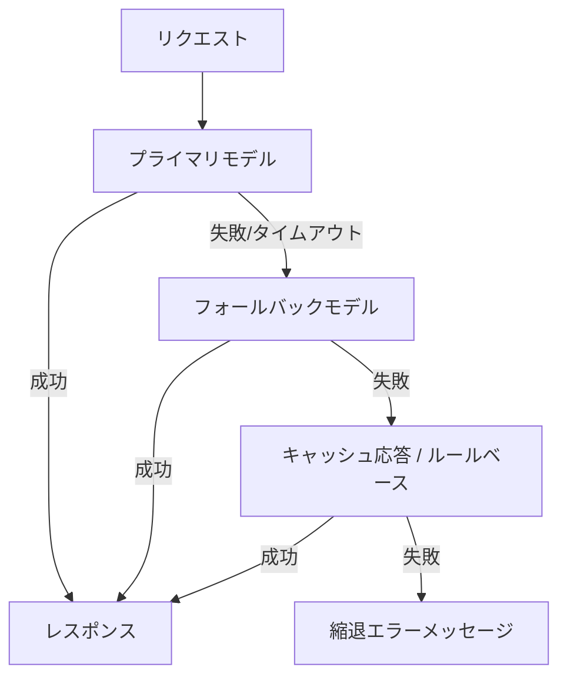

# #40 Fallback & Graceful Degradation｜フォールバック縮退

!!! abstract "一言"
    LLMプロバイダやツールの障害時に、**段階的に縮退**しながらサービスを継続する。

## 概要

外部LLMプロバイダは100%の可用性を保証しない。障害・レート制限・レイテンシ悪化が発生した際に、代替モデルへのフォールバック、機能縮退（一部機能をルールベースで代替）、キャッシュ応答の利用、最終手段としてのエラーメッセージ表示を段階的に実行する。ユーザーには「完全停止」ではなく「品質は下がるが動く」状態を提供する。

## 設計

フォールバックチェーンを定義し、上位が失敗すると順に下位へ降りる。各段階でタイムアウト・リトライ上限を設定し、遷移を高速に行う。回復検知（ヘルスチェック）でプライマリが復旧すればフォールバックを解除する。

## 解決する課題

単一プロバイダ依存では、障害時にサービス全体が停止する `[F9]`。特にエージェントが複数ステップの途中で停止すると、セッション全体が無駄になる。段階的縮退によりSLAを維持し、ユーザー体験の劣化を最小限に抑える。

## 向き / 不向き

- **向き**: 可用性SLAが厳しいサービス、複数プロバイダを利用可能な環境、24/7運用のカスタマーサポートやワークフロー自動化。
- **不向き**: 特定モデルの能力に強く依存し代替が存在しない場合（縮退しても品質が実用水準を下回る）。フォールバック先のモデルで副作用の一貫性が保てない場合。

## 要素技術

- フォールバック管理: LiteLLM Fallbacks、Portkey AI Gateway、カスタムリトライロジック
- ヘルスチェック: Circuit Breaker パターン（resilience4j、Polly）
- キャッシュ: [#38 Semantic Result Cache](38-semantic-result-cache.md) を縮退時応答に利用

## 選定（相反）

- **品質維持 ↔ 可用性維持** — フォールバック先の品質低下をどこまで許容するか `[F9]`。ミッションクリティカルなら品質閾値を設けフォールバック不可時は人間エスカレーション。→ [相反の選定基準](../../decisions/tradeoffs.md)

## 関連パターン

- [#37 Semantic Gateway](37-semantic-gateway-cost-aware-router.md) — 通常時のモデル選択とフォールバック時の代替選択を統合管理する
- [#38 Semantic Result Cache](38-semantic-result-cache.md) — キャッシュをフォールバックの一段階として活用する
- [#36 Shadow / Canary Deployment](../07-observability/36-shadow-canary-deployment.md) — フォールバック先モデルの品質を事前にカナリアで検証する

## 参考

- LiteLLM Fallbacks & Retries Documentation
- Microsoft Circuit Breaker Pattern
