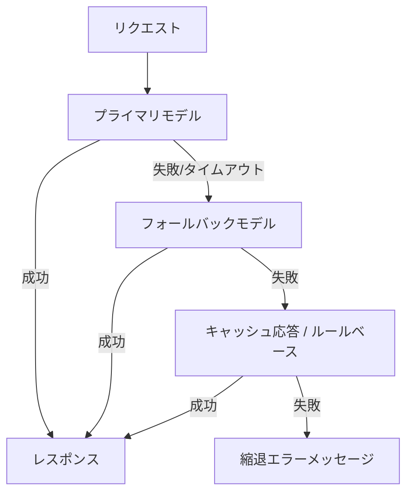

# #40 Fallback & Graceful Degradation｜フォールバック縮退

!!! abstract "一言"
    LLMプロバイダやツールの障害時に、**段階的に縮退**しながらサービスを継続します。

<!-- BEGIN:GEN:meta -->

メタデータ（機械可読） — #40 Fallback & Graceful Degradation｜フォールバック縮退

| 項目 | 値 |
|------|-----|
| **ID** | 40 |
| **カテゴリ** | 08-cost-scaling — コスト・性能・スケーリング |
| **フォース** | `[F9]` |
| **ダイヤル** | retry-count |
| **二者択一** | fail-fast-vs-degradation, single-vs-multi-provider |
| **関連パターン** | #37, #38, #36 |
| **向き** | 厳格なSLA、マルチプロバイダ利用可能、24/7運用（サポート・ワークフロー自動化） |
| **不向き** | 単一プロバイダ固定; 専門モデルのみ成功可能（特化モデル依存） |
| **要素技術** | LiteLLM Fallback, Portkey Gateway, resilience4j/Polly, サーキットブレーカー |

<!-- END:GEN:meta -->

## 概要

ある朝、主力LLMプロバイダが障害を起こし、エージェントが一切応答しなくなった――このような事態は実際に起こりえます。エージェントが複数ステップの処理途中で止まれば、セッション全体が無駄になってしまいます。

外部LLMプロバイダは100%の可用性を保証しません。障害・レート制限・レイテンシ悪化が発生した際には、代替モデルへのフォールバック、機能縮退（一部機能をルールベースで代替）、キャッシュ応答の利用、最終手段としてのエラーメッセージ表示を段階的に実行します。ユーザーには「完全停止」ではなく「品質は下がるが動く」状態を提供するのが狙いです。

!!! info "意思決定上の位置づけ"
    - **必要にするフォース**: `[F9]` プロバイダ信頼度
    - **関与する決定**: [程度（ダイヤル）](../../decisions/tuning-dials.md) の リトライ回数 / [相反](../../decisions/tradeoffs.md) の Fail-fast↔縮退
    - **意思決定の進め方**: [意思決定の進め方](../../decisions/decision-flow.md)

## 設計

フォールバックチェーンを定義し、上位が失敗すると順に下位へ降りていきます。各段階ではタイムアウト・リトライ上限を設定し、遷移を高速に行います。回復検知（ヘルスチェック）によりプライマリが復旧したことを確認できれば、フォールバックを解除します。

## 解決する課題

単一プロバイダに依存している場合、障害が起きるとサービス全体が停止してしまいます `[F9]`。特にエージェントが複数ステップの途中で停止すると、セッション全体が無駄になります。段階的な縮退によりSLAを維持し、ユーザー体験の劣化を最小限に抑えることができます。

## 向き / 不向き

- **向き**: 可用性SLAが厳しいサービス、複数プロバイダを利用可能な環境、24/7運用のカスタマーサポートやワークフロー自動化に適しています。
- **不向き**: 特定モデルの能力に強く依存しており代替が存在しない場合は、縮退しても品質が実用水準を下回ってしまいます。また、フォールバック先のモデルで副作用の一貫性が保てない場合にも向きません。

## 要素技術

- フォールバック管理: LiteLLM Fallbacks、Portkey AI Gateway、カスタムリトライロジック
- ヘルスチェック: Circuit Breaker パターン（resilience4j、Polly）
- キャッシュ: [#38 Semantic Result Cache](38-semantic-result-cache.md) を縮退時応答に利用

## 選定（相反）

- **品質維持 ↔ 可用性維持** — フォールバック先の品質低下をどこまで許容するか `[F9]`。ミッションクリティカルなら品質閾値を設けフォールバック不可時は人間エスカレーション。→ [相反の選定基準](../../decisions/tradeoffs.md)

## 関連パターン

- [#37 Semantic Gateway](37-semantic-gateway-cost-aware-router.md) — 通常時のモデル選択とフォールバック時の代替選択を統合管理する
- [#38 Semantic Result Cache](38-semantic-result-cache.md) — キャッシュをフォールバックの一段階として活用する
- [#36 Shadow / Canary Deployment](../07-observability/36-shadow-canary-deployment.md) — フォールバック先モデルの品質を事前にカナリアで検証する

## 参考

- LiteLLM Fallbacks & Retries Documentation
- Microsoft Circuit Breaker Pattern
