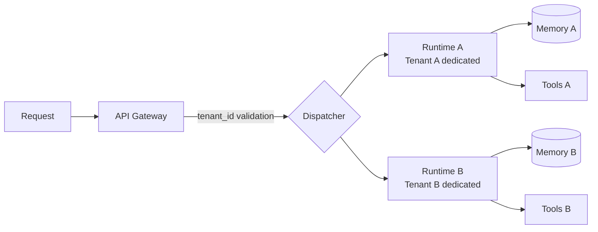

# #41 Tenant-Isolated Agent Runtime

!!! abstract "TL;DR"
    Isolate the agent's execution environment, memory, and tool permissions per tenant to structurally prevent data leakage and cross-contamination.

<!-- BEGIN:GEN:meta -->

Metadata (machine-readable) — #41 Tenant-Isolated Agent Runtime

| Field | Value |
|------|-----|
| **ID** | 41 |
| **Category** | 09-security — Security & Multi-tenancy |
| **Forces** | `[F5]`, `[F8]` |
| **Dials** | — |
| **Tradeoffs** | — |
| **Related Patterns** | #42, #43, #18 |
| **When to Use** | Multi-tenant SaaS, regulated industries (finance, healthcare), hundreds of tenants |
| **When Not to Use** | Single-tenant internal tools; thousands of tenants where cost is prohibitive |
| **Element Technologies** | Kubernetes Namespace, Firecracker, gVisor, Row-Level Security, OPA/Cedar |

<!-- END:GEN:meta -->

## Overview

In a SaaS-style agent service, if one customer's inquiry content leaks into another customer's response, it could lead not only to loss of trust but also to legal liability. In environments where multiple tenants share the same infrastructure, mixing LLM context windows, memory stores, and tool call targets across tenants can cause such leaks through prompt injection or simple bugs.

This pattern validates the tenant ID upon request receipt and isolates the entire execution path afterward -- context, memory, tool bindings, and logs -- on a per-tenant basis.

!!! info "Position in decision-making"
    - **Driving force**: `[F5]` Input Trustworthiness, `[F8]` Accountability & Regulation
    - **Decision flow**: [Decision Flow](../../decisions/decision-flow.md)

## Design

The dispatcher routes to a dedicated runtime instance (or container/namespace) based on tenant ID. Memory stores are separated by schema or prefix per tenant, and tool bindings are assigned tenant-specific authorization scopes. Logs always include tenant IDs, with access controls preventing cross-tenant searches.

## Problems Solved

Data leakage between tenants in a multi-tenant environment results not only in loss of trust but also legal liability `[F8]`. Since LLMs use all information in the context indiscriminately, environments with low input trustworthiness `[F5]` must account for intentional leakage via prompt injection. Without physical or logical isolation boundaries, defenses rely on "cautionary notes in prompts," which are fragile in production.

## When to Use / When Not to Use

- **When to Use**: Multi-tenant SaaS, regulated industries (finance, healthcare) where customer data mixing is unacceptable. When tenant count is in the hundreds and runtime isolation costs are acceptable.
- **When Not to Use**: Single-tenant internal tools. When tenant count is extremely large and per-runtime isolation is cost-prohibitive (consider logical isolation + guardrails instead).

## Element Technologies

- Container isolation: Kubernetes Namespace, Firecracker microVM, gVisor
- Memory isolation: PostgreSQL Row-Level Security, DynamoDB partition key, per-tenant schema
- Auth: OPA / Cedar for tenant-scoped policies
- Log isolation: Tenant ID-based log partitioning

## Tuning (Dials)

- **Isolation granularity (process vs. logical isolation)** — Physical isolation offers the strongest security but at higher cost vs. logical isolation is efficient but risks boundary breaches / Deciding factors `[F8]` `[F5]` / Guideline: Physical isolation for highly regulated tenants, logical isolation for others. → [Tuning Dials](../../decisions/tuning-dials.md)

## Related Patterns

- [#42 Data Boundary Firewall](42-data-boundary-firewall.md) — Layer data inspection on top of tenant isolation
- [#43 Confused-Deputy Damage Limitation](43-confused-deputy-damage-limitation.md) — Limit blast radius even within isolation boundaries
- [#18 Least-Privilege Tool Binding](../04-tools-mcp/18-least-privilege-tool-binding.md) — Minimize tool permissions per tenant

## References

- OWASP LLM Top 10 — LLM06: Sensitive Information Disclosure
