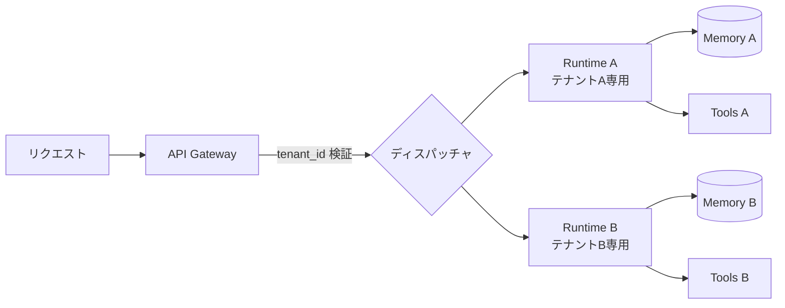

# #41 Tenant-Isolated Agent Runtime｜テナント分離ランタイム

!!! abstract "一言"
    テナント毎にエージェントの実行環境・メモリ・ツール権限を分離し、データ漏洩と相互干渉を構造的に防ぐ。

## 概要

SaaS型エージェントサービスでは、複数テナントが同一インフラを共有する。LLMのコンテキスト窓やメモリストア、ツール呼び出し先がテナント間で混在すると、プロンプトインジェクションや単純なバグによってテナントAのデータがテナントBへ漏洩する。本パターンはリクエスト受付時にテナントIDを検証し、以降の実行パス全体――コンテキスト、メモリ、ツールバインディング、ログ――をテナント単位で隔離する。

!!! info "意思決定上の位置づけ"
    - **必要にするフォース**: `[F5]` 入力の信頼度・`[F8]` 説明責任・規制
    - **意思決定の進め方**: [意思決定の進め方](../../decisions/decision-flow.md)

## 設計

ディスパッチャはテナントIDに基づき、専用のランタイムインスタンス（またはコンテナ／名前空間）へルーティングする。メモリストアはテナントごとにスキーマまたはプレフィックスで分離し、ツールバインディングもテナント固有の認可スコープを適用する。ログにはテナントIDを必ず付与し、横断検索を防ぐアクセス制御を敷く。

## 解決する課題

マルチテナント環境でテナント間のデータ漏洩が発生すると、信頼喪失だけでなく法的責任を負う `[F8]`。LLMはコンテキストに含まれる情報を区別なく利用するため、入力の信頼度が低い環境 `[F5]` ではプロンプトインジェクションによる意図的な漏洩も想定しなければならない。物理的・論理的な分離境界がなければ、防御は「プロンプトの注意書き」に依存することになり、本番では脆い。

## 向き / 不向き

- **向き**: マルチテナントSaaS、規制業界（金融・医療）で顧客データの混在が許されないケース。テナント数が数百以下でランタイム分離のコストが許容できる場合。
- **不向き**: 単一テナントの社内ツール。テナント数が極めて多くランタイムごとの分離がコスト的に非現実的な場合（論理分離＋ガードレールの組み合わせを検討）。

## 要素技術

- コンテナ分離: Kubernetes Namespace、Firecracker microVM、gVisor
- メモリ分離: PostgreSQL Row-Level Security、DynamoDB パーティションキー、テナント別スキーマ
- 認証・認可: OPA / Cedar によるテナントスコープポリシー
- ログ分離: テナントIDベースのログパーティショニング

## 調整（程度）

- **分離の粒度（プロセス ↔ 論理分離）** — 物理分離はセキュリティ最強だがコスト大 ⇔ 論理分離は効率的だが境界破壊のリスク / 決め手 `[F8]``[F5]` / 目安: 規制要件が高いテナントは物理分離、それ以外は論理分離。→ [程度ダイヤル](../../decisions/tuning-dials.md)

## 関連パターン

- [#42 Data Boundary Firewall](42-data-boundary-firewall.md) — テナント分離の上にデータ検査層を重ねる
- [#43 Confused-Deputy Damage Limitation](43-confused-deputy-damage-limitation.md) — 分離境界内でも被害半径を制限する
- [#18 Least-Privilege Tool Binding](../04-tools-mcp/18-least-privilege-tool-binding.md) — テナント毎のツール権限を最小化する

## 参考

- OWASP LLM Top 10 — LLM06: Sensitive Information Disclosure
