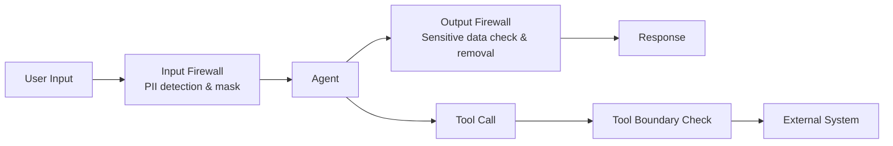

# #42 Data Boundary Firewall

!!! abstract "TL;DR"
    Inspect and mask PII and sensitive information at the agent's I/O boundaries to prevent unintended data leakage.

<!-- BEGIN:GEN:meta -->

Metadata (machine-readable) — #42 Data Boundary Firewall

| Field | Value |
|------|-----|
| **ID** | 42 |
| **Category** | 09-security — Security & Multi-tenancy |
| **Forces** | `[F5]`, `[F8]` |
| **Dials** | — |
| **Tradeoffs** | — |
| **Related Patterns** | #41, #29, #17 |
| **When to Use** | Agents handling PII/health/financial data, external LLM APIs, GDPR/regulatory targets |
| **When Not to Use** | Public data only; masking would break business logic |
| **Element Technologies** | Presidio, DLP, spaCy NER, PII masking, OPA/Rego, audit event logs |

<!-- END:GEN:meta -->

## Overview

When a user sends a message containing credit card numbers or addresses, it becomes a serious data leak if the LLM includes them verbatim in summaries or tool call arguments. LLMs can inadvertently incorporate personal or sensitive data from inputs into their outputs.

This pattern places firewall layers both before agent input and after agent output, performing PII detection, sensitivity classification, masking, and blocking. By inspecting data every time it crosses a trust boundary, it also addresses information extraction via prompt injection.

!!! info "Position in decision-making"
    - **Driving force**: `[F5]` Input Trustworthiness, `[F8]` Accountability & Regulation
    - **Decision flow**: [Decision Flow](../../decisions/decision-flow.md)

## Design

The input side detects PII (names, emails, phone numbers, credit card numbers, etc.) using regex + NER models, masking or tokenizing before passing to the LLM. The output side checks for exposure of data labeled as sensitive. Tool call arguments and return values are also subject to inspection.

## Problems Solved

When agent-handled data contains PII or trade secrets, there is a risk of leakage through LLM responses or tool calls `[F5]`. Under regulations like GDPR and data protection laws, cross-border data transfer and purpose deviation directly translate to legal risk `[F8]`. Inspecting only outputs misses indirect leakage via tools.

## When to Use / When Not to Use

- **When to Use**: Agents handling PII, medical data, or financial data. Configurations that send data to external LLM APIs with data boundary risks.
- **When Not to Use**: Use cases handling only public data with no confidentiality concerns. When masking causes critical business information loss that significantly degrades agent judgment quality (masking granularity adjustment is needed).

## Element Technologies

- PII detection: Microsoft Presidio, Google Cloud DLP, spaCy NER custom models
- Masking: Tokenization (reversible), irreversible hashing, generalization (date → year only, etc.)
- Policy definition: OPA / Rego for data classification-specific processing rules
- Audit logs: Record detection, masking, and blocking events

## Tuning (Dials)

- **Masking granularity (strict vs. lenient)** — Too strict removes context the agent needs for judgment, degrading quality vs. too lenient increases leakage risk / Deciding factors `[F5]` `[F8]` / Guideline: Strict for regulated data, more lenient for business context data. → [Tuning Dials](../../decisions/tuning-dials.md)

## Related Patterns

- [#41 Tenant-Isolated Agent Runtime](41-tenant-isolated-agent-runtime.md) — Combine with tenant isolation for defense in depth
- [#29 Guardrail Sidecar + Self-Correction](../06-reliability/29-guardrail-sidecar-self-correction.md) — Generalized output inspection pattern
- [#17 Tool / MCP Gateway](../04-tools-mcp/17-tool-mcp-gateway.md) — Coordinate with tool call authorization and auditing

## References

- Microsoft Presidio: https://github.com/microsoft/presidio
- OWASP LLM Top 10 — LLM06: Sensitive Information Disclosure
