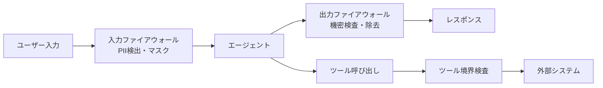

# #42 Data Boundary Firewall｜データ境界ファイアウォール

!!! abstract "一言"
    エージェントの入出力境界でPII・機密情報を検査・マスクし、意図しない情報漏洩を防ぐ。

## 概要

LLMは入力に含まれた個人情報や機密データを、要約・回答・ツール呼び出しの引数として意図せず出力に混入させることがある。本パターンでは、エージェントへの入力前と出力後の両方にファイアウォール層を設置し、PII検出・機密分類・マスキング・ブロックを実行する。データが信頼境界を越えるたびに検査することで、プロンプトインジェクション経由の情報抽出にも対処できる。

!!! info "意思決定上の位置づけ"
    - **必要にするフォース**: `[F5]` 入力の信頼度・`[F8]` 説明責任・規制
    - **意思決定の進め方**: [意思決定の進め方](../../decisions/decision-flow.md)

## 設計

入力側ではPII（氏名・メール・電話番号・クレジットカード番号等）を正規表現＋NERモデルで検出し、マスクまたはトークン化してからLLMに渡す。出力側では機密ラベル付きデータの露出がないかを検査する。ツール呼び出しの引数・戻り値についても同様に検査の対象とする。

## 解決する課題

エージェントが扱うデータにPIIや企業秘密が含まれる場合、LLMの応答やツール呼び出しを通じて外部に漏洩するリスクがある `[F5]`。GDPR・個人情報保護法などの規制下では、データの越境・目的外利用が法的リスクに直結する `[F8]`。出力のみの検査では、ツール経由の間接的な漏洩を見逃してしまう。

## 向き / 不向き

- **向き**: PII・医療情報・財務データを扱うエージェント。外部LLM APIにデータを送信する構成で、データ越境リスクがあるケース。
- **不向き**: 公開データのみを扱い機密性の懸念がないユースケース。マスキングにより業務上必要な情報が欠落し、エージェントの判断品質が著しく劣化する場合（マスク粒度の調整が必要）。

## 要素技術

- PII検出: Microsoft Presidio、Google Cloud DLP、spaCy NERカスタムモデル
- マスキング: トークン化（復元可能）、不可逆ハッシュ、汎化（日付→年のみ等）
- ポリシー定義: OPA / Rego でデータ分類ごとの処理ルールを記述
- 監査ログ: 検出・マスク・ブロックのイベントを記録

## 調整（程度）

- **マスク粒度（厳格 ↔ 寛容）** — 厳格すぎるとエージェントに必要な文脈が失われ判断品質が低下 ⇔ 寛容すぎると漏洩リスク / 決め手 `[F5]``[F8]` / 目安: 規制対象データは厳格、業務文脈データは寛容寄り。→ [程度ダイヤル](../../decisions/tuning-dials.md)

## 関連パターン

- [#41 Tenant-Isolated Agent Runtime](41-tenant-isolated-agent-runtime.md) — テナント分離と組み合わせて多層防御を構成
- [#29 Guardrail Sidecar + Self-Correction](../06-reliability/29-guardrail-sidecar-self-correction.md) — 出力検査の一般化パターン
- [#17 Tool / MCP Gateway](../04-tools-mcp/17-tool-mcp-gateway.md) — ツール呼び出し時の認可・監査と連携

## 参考

- Microsoft Presidio: https://github.com/microsoft/presidio
- OWASP LLM Top 10 — LLM06: Sensitive Information Disclosure
