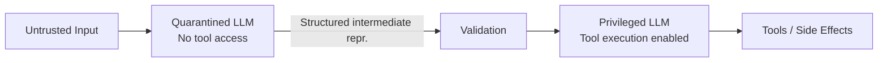

# #44 Dual-LLM Privilege Separation

!!! abstract "TL;DR"
    Separate a "quarantined LLM" that processes untrusted input from a "privileged LLM" that executes side effects, structurally containing injection attack damage.

<!-- BEGIN:GEN:meta -->

Metadata (machine-readable) — #44 Dual-LLM Privilege Separation

| Field | Value |
|------|-----|
| **ID** | 44 |
| **Category** | 09-security — Security & Multi-tenancy |
| **Forces** | `[F5]`, `[F2]` |
| **Dials** | — |
| **Tradeoffs** | — |
| **Related Patterns** | #43, #15, #20 |
| **When to Use** | Untrusted input → tool chain, high-risk side effects (payments, deletions, notifications) |
| **When Not to Use** | Trusted input in closed environments; dual-pass latency/cost unacceptable |
| **Element Technologies** | Quarantined LLM (small/sandboxed), schema validation, Privileged LLM (tool execution) |

<!-- END:GEN:meta -->

## Overview

Consider an agent that reads emails and auto-replies. If the email body contains prompt injection, not only the reply but also side effects like money transfers or customer data exfiltration could be executed. Giving tool execution privileges directly to the LLM that processes external input poses significant danger.

This pattern runs a "Quarantined LLM" that handles untrusted input and a "Privileged LLM" that actually executes side effects as separate processes with separate permissions. The quarantined LLM's output is limited to structured intermediate representations, and the privileged LLM only accepts those intermediate representations as input.

!!! info "Position in decision-making"
    - **Driving force**: `[F5]` Input Trustworthiness, `[F2]` Failure Cost
    - **Decision flow**: [Decision Flow](../../decisions/decision-flow.md)

## Design

The quarantined LLM only performs natural language parsing, classification, and summarization, with its output constrained to structured formats such as JSON schemas. The validation layer performs schema verification and range checks, after which the privileged LLM executes tool calls based on the structured input. The privileged LLM never touches raw natural language input.

## Problems Solved

The root cause of prompt injection is "instructions and input data being mixed," but fully separating them is difficult given the nature of LLMs `[F5]`. This pattern cuts the pathway where "contaminated output directly becomes side effects," containing real harm even when injection succeeds. The higher the failure cost of operations (money transfers, data deletion, etc.), the greater the effect of this separation `[F2]`.

## When to Use / When Not to Use

- **When to Use**: Pipelines where untrusted input leads to tool execution, such as email processing, customer support, and external document analysis. Cases involving high-risk side effects (payments, deletions, notification sending).
- **When Not to Use**: Closed environments where all input is trusted (internal-only, fixed input). Real-time use cases where the latency and cost overhead of a dual-LLM two-stage configuration is unacceptable.

## Element Technologies

- Quarantined LLM: Small model or executed in a sandboxed container, network access restricted
- Intermediate representation: Typed with JSON Schema / Pydantic models, applying [#14 Structured Output Contract](../03-io-contract/14-structured-output-contract.md)
- Validation: Schema verification, value range checks, allowlist matching
- Privileged LLM: With tool bindings, but accepting only structured input

## Selection (Tradeoffs)

- **Single LLM vs. Dual LLM** — Whether input is trustworthy `[F5]`, failure cost of side effects `[F2]`. Trusted input + low-risk side effects: single is sufficient; otherwise consider dual. → [Tradeoff Selection Criteria](../../decisions/tradeoffs.md)

## Related Patterns

- [#43 Confused-Deputy Damage Limitation](43-confused-deputy-damage-limitation.md) — This pattern is a concrete implementation of damage limitation
- [#15 Inverted Structured Output](../03-io-contract/15-inverted-structured-output.md) — Shares the concept of making intermediate decisions structured output
- [#20 Sandboxed Tool Runtime](../04-tools-mcp/20-sandboxed-tool-runtime.md) — Further isolation on the tool execution side

## References

- Rich Harang, "The Dual LLM pattern for building AI assistants that can resist prompt injection" (2023)
