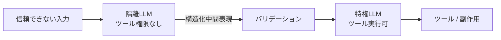

# #44 Dual-LLM Privilege Separation｜デュアルLLM権限分離

!!! abstract "一言"
    信頼できない入力を処理する「隔離LLM」と、副作用を実行する「特権LLM」を分離することで、インジェクション攻撃の被害を構造的に封じ込める。

## 概要

外部入力（ユーザーメッセージ、メール本文、Webページ等）を直接処理するLLMにツール実行権限を与えると、プロンプトインジェクションが即座に副作用につながってしまう。本パターンでは、信頼できない入力を扱う「隔離LLM（Quarantined LLM）」と、実際に副作用を実行する「特権LLM（Privileged LLM）」を別プロセス・別権限で動かす。隔離LLMの出力は構造化された中間表現に限定し、特権LLMはその中間表現のみを入力として受け取る仕組みである。

!!! info "意思決定上の位置づけ"
    - **必要にするフォース**: `[F5]` 入力の信頼度・`[F2]` 失敗コスト
    - **意思決定の進め方**: [意思決定の進め方](../../decisions/decision-flow.md)

## 設計

隔離LLMは自然言語の解析・分類・要約のみを行い、出力は JSON スキーマ等の構造化フォーマットに制約する。バリデーション層でスキーマ検証・範囲チェックを行った後、特権LLMが構造化入力に基づいてツール呼び出しを実行する。特権LLMは生の自然言語入力に一切触れない。

## 解決する課題

プロンプトインジェクションの根本原因は「命令と入力データが混在すること」にあるが、LLMの性質上、これらを完全に分離するのは難しい `[F5]`。本パターンは「汚染された出力がそのまま副作用になる経路」を断つことで、インジェクションが成功しても実害を封じ込める。失敗コストが高い操作（送金・データ削除等）ほど、この分離の効果は大きくなる `[F2]`。

## 向き / 不向き

- **向き**: メール処理、カスタマーサポート、外部ドキュメント分析など、信頼できない入力がツール実行に至るパイプライン。高リスク副作用（決済・削除・通知送信）を伴うケース。
- **不向き**: 入力が全て信頼できる閉じた環境（社内限定・入力が固定）。隔離LLMと特権LLMの2段構成のレイテンシ・コスト増が許容できないリアルタイム用途。

## 要素技術

- 隔離LLM: 小型モデルまたはサンドボックスコンテナ内で実行、ネットワークアクセス制限
- 中間表現: JSON Schema / Pydantic モデルで型付け、[#14 Structured Output Contract](../03-io-contract/14-structured-output-contract.md) を適用
- バリデーション: スキーマ検証、値域チェック、許可リスト照合
- 特権LLM: ツールバインディング付き、ただし構造化入力のみ受理

## 選定（相反）

- **単一LLM ↔ デュアルLLM** — 入力が信頼できるか `[F5]`、副作用の失敗コスト `[F2]`。信頼できる入力＋低リスク副作用なら単一で十分、それ以外はデュアルを検討。→ [相反の選定基準](../../decisions/tradeoffs.md)

## 関連パターン

- [#43 Confused-Deputy Damage Limitation](43-confused-deputy-damage-limitation.md) — 本パターンは被害限定の具体的な実装手段
- [#15 Inverted Structured Output](../03-io-contract/15-inverted-structured-output.md) — 中間判断を構造化出力にする考え方と共通
- [#20 Sandboxed Tool Runtime](../04-tools-mcp/20-sandboxed-tool-runtime.md) — ツール実行側のさらなる隔離

## 参考

- Rich Harang, "The Dual LLM pattern for building AI assistants that can resist prompt injection" (2023)
