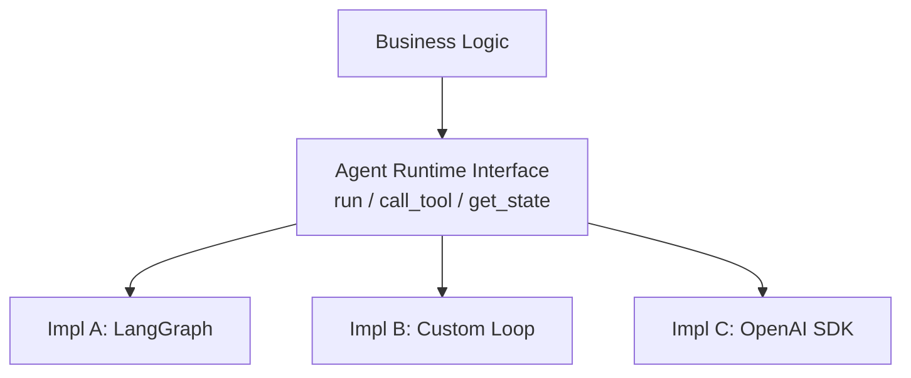

# #45 Agent Runtime Abstraction

!!! abstract "TL;DR"
    Abstract the agent's execution platform to prevent lock-in to specific frameworks or SDKs.

<!-- BEGIN:GEN:meta -->

Metadata (machine-readable) — #45 Agent Runtime Abstraction

| Field | Value |
|------|-----|
| **ID** | 45 |
| **Category** | 10-deployment — Deployment, Vendor Abstraction & Migration |
| **Forces** | `[F9]`, `[F8]` |
| **Dials** | — |
| **Tradeoffs** | build-vs-buy |
| **Related Patterns** | #46, #47, #48 |
| **When to Use** | Multi-year production operation, multi-framework evaluation, future vendor risk |
| **When Not to Use** | PoC/short-term; heavy reliance on framework-specific features; speed-first prototyping |
| **Element Technologies** | Python Protocol/ABC, TypeScript interface, DI (dependency-injector/tsyringe), LangChain/LangGraph/OpenAI SDK/Semantic Kernel |

<!-- END:GEN:meta -->

## Overview

The agent framework you chose six months ago has stalled in development and security patches are no longer being released -- in a domain where framework lifecycles are short, this is not unusual. If the entire codebase is tightly coupled to that SDK, migration becomes a massive rewrite.

LangChain, CrewAI, Semantic Kernel, OpenAI Agents SDK -- agent frameworks are proliferating, and all are still maturing. This pattern wraps agent execution (loop control, tool calls, state management) behind abstract interfaces, making the implementation swappable.

!!! info "Position in decision-making"
    - **Driving force**: `[F9]` Provider Reliability, `[F8]` Accountability & Regulation
    - **Related decision**: Build vs. buy, Single vs. multi-provider in [Tradeoffs](../../decisions/tradeoffs.md)
    - **Decision flow**: [Decision Flow](../../decisions/decision-flow.md)

## Design

The abstract interface defines minimal operations -- `run(task)`, `call_tool(name, args)`, `get_state()`, `set_state()`. Framework-specific features are translated through an adapter layer. Business logic (prompts, workflow definitions, validation rules) is written on top of the interface, and implementation switching is done via DI (dependency injection) or configuration files.

## Problems Solved

Agent framework lifecycles are short, with the mainstream potentially changing within six months `[F9]`. Deep coupling to framework-specific APIs inflates migration costs, leading to "don't touch it because it works" inertia. There is also a risk that auditing or regulatory requirements prohibit use of specific vendor SDKs `[F8]`.

## When to Use / When Not to Use

- **When to Use**: Production environments expecting multi-year operation. Teams evaluating multiple frameworks who want the option to switch later.
- **When Not to Use**: PoC or short-term projects where speed is the priority. When you want to fully leverage advanced framework-specific features (graph definitions, etc.), the abstraction cost may not be justified.

## Element Technologies

- Interface definition: Python Protocol / ABC, TypeScript interface
- DI: dependency-injector, tsyringe
- Adapter implementations: LangChain / LangGraph, OpenAI Agents SDK, Semantic Kernel, custom implementation

## Selection (Tradeoffs)

- **Thin abstraction vs. thick abstraction** — Too thin and framework differences leak through vs. too thick and you kill each framework's strengths. Deciding factor `[F9]`: likelihood of provider switching. → [Tradeoff Selection Criteria](../../decisions/tradeoffs.md)

## Related Patterns

- [#46 Model Behavior Compatibility Layer](46-model-behavior-compatibility-layer.md) — Combine with model difference absorption layer
- [#47 Agent Capability Registry](47-agent-capability-registry.md) — Registry-manage capabilities of abstracted runtimes
- [#48 Strangler Fig](48-strangler-fig.md) — Strategy for incrementally migrating runtimes

## References

- Hexagonal Architecture (Ports & Adapters) pattern
