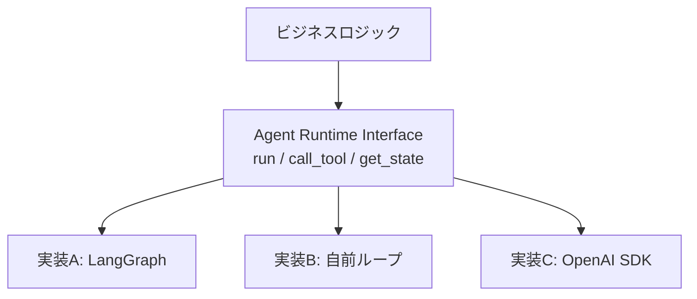

# #45 Agent Runtime Abstraction｜ランタイム抽象化

!!! abstract "一言"
    エージェントの実行基盤を抽象化し、特定フレームワークやSDKへのロックインを防ぐ。

## 概要

LangChain、CrewAI、Semantic Kernel、OpenAI Agents SDK――エージェントフレームワークは乱立しており、いずれも成熟途上にある。特定SDKのAPIに直接依存すると、フレームワークの破壊的変更やプロジェクトの停滞がビジネスリスクになりかねない。本パターンでは、エージェントの実行（ループ制御・ツール呼び出し・状態管理）を抽象インタフェースで囲い、実装を差し替え可能にする。

!!! info "意思決定上の位置づけ"
    - **必要にするフォース**: `[F9]` プロバイダ信頼度・`[F8]` 説明責任・規制
    - **関与する決定**: [相反](../../decisions/tradeoffs.md) の ビルド↔バイ・単一↔マルチプロバイダ
    - **意思決定の進め方**: [意思決定の進め方](../../decisions/decision-flow.md)

## 設計

抽象インタフェースは最小限の操作――`run(task)`, `call_tool(name, args)`, `get_state()`, `set_state()`――を定義する。各フレームワーク固有の機能はアダプタ層で変換する。ビジネスロジック（プロンプト、ワークフロー定義、検証ルール）はインタフェースの上に書き、実装の切り替えはDI（依存注入）や設定ファイルで行う。

## 解決する課題

エージェントフレームワークのライフサイクルは短く、半年で主流が変わることもある `[F9]`。フレームワーク固有のAPIに深く結合すると、移行コストが膨らんで「動いているから触れない」状態になりがちである。また、監査・規制対応で特定ベンダーのSDKが使えなくなるリスクもある `[F8]`。

## 向き / 不向き

- **向き**: 複数年の運用を見込むプロダクション環境。チームが複数のフレームワークを評価中で、後から切り替えたいケース。
- **不向き**: PoC・短期プロジェクトで速度優先のケース。フレームワーク固有の高度な機能（グラフ定義等）をフル活用したい場合は、抽象化のコストが見合わない可能性がある。

## 要素技術

- インタフェース定義: Python Protocol / ABC、TypeScript interface
- DI: dependency-injector、tsyringe
- アダプタ実装: LangChain / LangGraph、OpenAI Agents SDK、Semantic Kernel、自前実装

## 選定（相反）

- **薄い抽象 ↔ 厚い抽象** — 薄すぎるとフレームワーク差が漏れる ⇔ 厚すぎると各フレームワークの強みを殺す。決め手 `[F9]`：プロバイダ切り替えの蓋然性。→ [相反の選定基準](../../decisions/tradeoffs.md)

## 関連パターン

- [#46 Model Behavior Compatibility Layer](46-model-behavior-compatibility-layer.md) — モデル差の吸収レイヤーと組み合わせる
- [#47 Agent Capability Registry](47-agent-capability-registry.md) — 抽象化されたランタイムの能力を台帳管理
- [#48 Strangler Fig](48-strangler-fig.md) — 段階的にランタイムを移行する戦略

## 参考

- Hexagonal Architecture (Ports & Adapters) パターン
