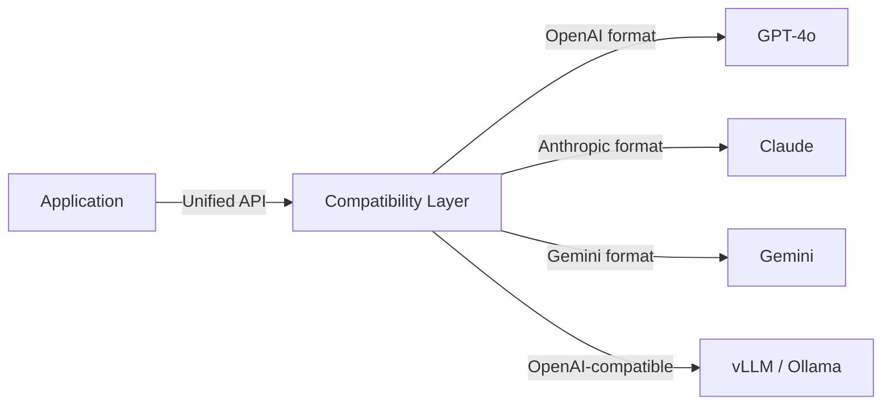

# #46 Model Behavior Compatibility Layer

!!! abstract "TL;DR"
    Insert a compatibility layer to absorb API differences and behavioral discrepancies between model providers, minimizing friction when switching models.

<!-- BEGIN:GEN:meta -->

Metadata (machine-readable) — #46 Model Behavior Compatibility Layer

| Field | Value |
|------|-----|
| **ID** | 46 |
| **Category** | 10-deployment — Deployment, Vendor Abstraction & Migration |
| **Forces** | `[F9]` |
| **Dials** | — |
| **Tradeoffs** | single-vs-multi-provider |
| **Related Patterns** | #45, #40, #37 |
| **When to Use** | Multi-model operation/comparison, provider fallback, cost-based dynamic routing |
| **When Not to Use** | Single vendor lock-in acceptable; maximize vendor-specific API usage |
| **Element Technologies** | LiteLLM, OpenRouter, AI SDK (Vercel), adapter wrappers, golden test regression |

<!-- END:GEN:meta -->

## Overview

After switching from OpenAI to Anthropic, the code breaks because function calling specifications differ. You want to fallback urgently, but cannot respond immediately because each provider has different API calling conventions. This friction frequently arises in multi-model operations and provider failure response.

This pattern inserts a compatibility layer between the caller and models, performing request/response normalization, function calling schema translation, and token count unification. It absorbs differences between providers -- OpenAI, Anthropic, Google, open-source models -- enabling model switching through configuration changes alone.

!!! info "Position in decision-making"
    - **Driving force**: `[F9]` Provider Reliability
    - **Related decision**: Single vs. multi-provider in [Tradeoffs](../../decisions/tradeoffs.md)
    - **Decision flow**: [Decision Flow](../../decisions/decision-flow.md)

## Design

The compatibility layer handles: (1) request normalization (message format, system prompt handling), (2) function calling / tool use schema translation, (3) response conversion to a unified format, (4) unified token count and cost calculation. Model-specific parameters (temperature, top_p, etc.) are passed through, but default value differences are normalized.

## Problems Solved

LLM provider outages, price increases, and API deprecations actually occur `[F9]`. When model switching requires code changes beyond prompts, switching decisions are delayed and recovery time during failures increases. With a compatibility layer, you can switch to a fallback target through configuration changes alone.

## When to Use / When Not to Use

- **When to Use**: Environments using or comparing multiple models. Production services that want provider fallback during outages. Cases using dynamic model selection for cost optimization.
- **When Not to Use**: When fully committed to a single provider with no switching plans. When you want to maximize advanced provider-specific features (caching API, batch API, etc.).

## Element Technologies

- Existing libraries: LiteLLM, OpenRouter, AI SDK (Vercel)
- Custom implementation: Wrap per-provider clients using the adapter pattern
- Testing: Golden test regression verification across provider outputs

## Related Patterns

- [#45 Agent Runtime Abstraction](45-agent-runtime-abstraction.md) — Combine with overall runtime abstraction
- [#40 Fallback & Graceful Degradation](../08-cost-scaling/40-fallback-graceful-degradation.md) — Implement fallback strategies on top of the compatibility layer
- [#37 Semantic Gateway & Cost-Aware Router](../08-cost-scaling/37-semantic-gateway-cost-aware-router.md) — Perform cost-based routing on top of the compatibility layer

## References

- LiteLLM: https://github.com/BerriAI/litellm
