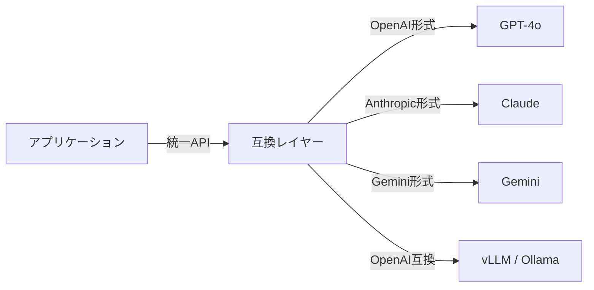

# #46 Model Behavior Compatibility Layer｜互換レイヤー

!!! abstract "一言"
    モデルプロバイダ間のAPI差異・挙動差を吸収する互換層を設け、モデル切り替えの摩擦を最小化する。

## 概要

OpenAI、Anthropic、Google、オープンソースモデルは、それぞれAPIフォーマット、function calling の仕様、トークン計算、ストップシーケンスの挙動が異なる。モデルを直接呼び出すコードが散在していると、プロバイダの切り替えが全面改修になってしまう。本パターンでは、呼び出し側とモデルの間に互換レイヤーを挿入し、リクエスト／レスポンスの正規化、function callingスキーマの変換、トークンカウントの統一を行う。

!!! info "意思決定上の位置づけ"
    - **必要にするフォース**: `[F9]` プロバイダ信頼度
    - **関与する決定**: [相反](../../decisions/tradeoffs.md) の 単一↔マルチプロバイダ
    - **意思決定の進め方**: [意思決定の進め方](../../decisions/decision-flow.md)

## 設計

互換レイヤーは以下を担う: (1) リクエストの正規化（メッセージ形式、システムプロンプトの扱い）、(2) function calling / tool use スキーマの相互変換、(3) レスポンスの統一フォーマットへの変換、(4) トークン数・コストの統一計算。モデル固有のパラメータ（temperature、top_p等）はパススルーするが、デフォルト値の差異は正規化する。

## 解決する課題

LLMプロバイダの障害・値上げ・API廃止は実際に起こりうる `[F9]`。モデル切り替えにプロンプト以外のコード変更が伴うと、切り替え判断が遅れ、障害時の復旧時間も長くなる。互換レイヤーがあれば、設定変更だけでフォールバック先に切り替えることができる。

## 向き / 不向き

- **向き**: 複数モデルを併用・比較する環境。プロバイダ障害時にフォールバックしたい本番サービス。コスト最適化のためモデルを動的に選択するケース。
- **不向き**: 単一プロバイダに完全にコミットしており、切り替え予定がないケース。プロバイダ固有の高度な機能（キャッシュAPI、バッチAPI等）を最大限活用したい場合。

## 要素技術

- 既存ライブラリ: LiteLLM、OpenRouter、AI SDK (Vercel)
- 自前実装: アダプタパターンでプロバイダごとのクライアントをラップ
- テスト: 各プロバイダの出力をゴールデンテストで回帰検証

## 関連パターン

- [#45 Agent Runtime Abstraction](45-agent-runtime-abstraction.md) — ランタイム全体の抽象化と組み合わせる
- [#40 Fallback & Graceful Degradation](../08-cost-scaling/40-fallback-graceful-degradation.md) — 互換レイヤーの上でフォールバック戦略を実装
- [#37 Semantic Gateway & Cost-Aware Router](../08-cost-scaling/37-semantic-gateway-cost-aware-router.md) — 互換レイヤーの上でコストベースのルーティングを行う

## 参考

- LiteLLM: https://github.com/BerriAI/litellm
