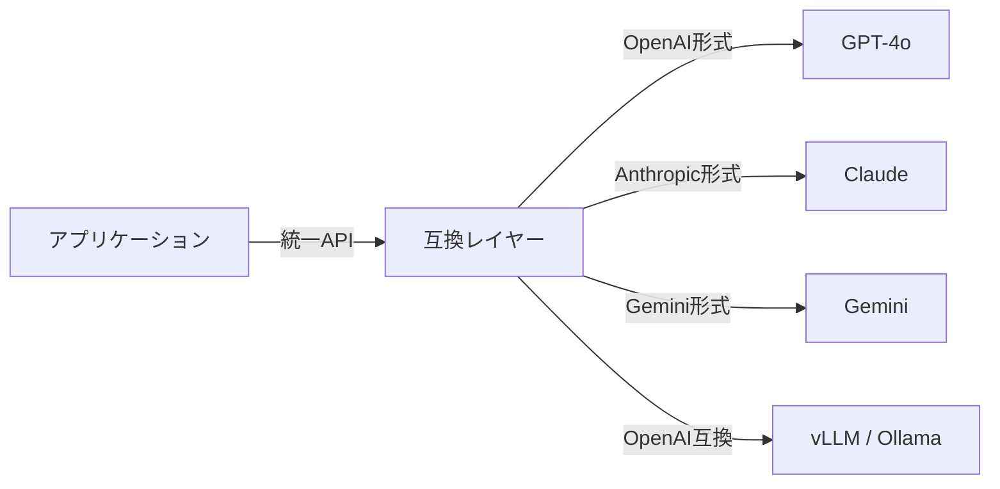

# #46 Model Behavior Compatibility Layer｜互換レイヤー

!!! abstract "一言"
    モデルプロバイダ間のAPI差異・挙動差を吸収する互換層を設け、モデル切り替えの摩擦を最小化します。

<!-- BEGIN:GEN:meta -->

メタデータ（機械可読） — #46 Model Behavior Compatibility Layer｜互換レイヤー

| 項目 | 値 |
|------|-----|
| **ID** | 46 |
| **カテゴリ** | 10-deployment — デプロイ・ベンダー抽象化・移行 |
| **フォース** | `[F9]` |
| **ダイヤル** | — |
| **二者択一** | single-vs-multi-provider |
| **関連パターン** | #45, #40, #37 |
| **向き** | マルチモデル運用/比較、プロバイダフォールバック、コスト動的ルーティング |
| **不向き** | 単一ベンダーロックイン許容; ベンダー固有API最大活用 |
| **要素技術** | LiteLLM, OpenRouter, AI SDK (Vercel), アダプタラッパー, ゴールデンテスト回帰 |

<!-- END:GEN:meta -->

## 概要

OpenAIからAnthropicに切り替えたら、function callingの仕様が違ってコードが動かなくなった。急いでフォールバックしたいのに、プロバイダごとにAPIの呼び方が違うため即座に対応できない。こうした摩擦は、マルチモデル運用やプロバイダ障害対応で頻繁に発生します。

本パターンでは、呼び出し側とモデルの間に互換レイヤーを挿入し、リクエスト／レスポンスの正規化、function callingスキーマの変換、トークンカウントの統一を行います。OpenAI、Anthropic、Google、オープンソースモデルといったプロバイダ間の差異を吸収し、設定変更だけでモデルを切り替えられるようにします。

!!! info "意思決定上の位置づけ"
    - **必要にするフォース**: `[F9]` プロバイダ信頼度
    - **関与する決定**: [相反](../../decisions/tradeoffs.md) の 単一↔マルチプロバイダ
    - **意思決定の進め方**: [意思決定の進め方](../../decisions/decision-flow.md)

## 設計

互換レイヤーは以下を担います: (1) リクエストの正規化（メッセージ形式、システムプロンプトの扱い）、(2) function calling / tool use スキーマの相互変換、(3) レスポンスの統一フォーマットへの変換、(4) トークン数・コストの統一計算。モデル固有のパラメータ（temperature、top_p等）はパススルーしますが、デフォルト値の差異は正規化します。

## 解決する課題

LLMプロバイダの障害・値上げ・API廃止は実際に起こりえます `[F9]`。モデル切り替えにプロンプト以外のコード変更が伴うと、切り替え判断が遅れ、障害時の復旧時間も長くなります。互換レイヤーがあれば、設定変更だけでフォールバック先に切り替えることができます。

## 向き / 不向き

- **向き**: 複数モデルを併用・比較する環境に適しています。プロバイダ障害時にフォールバックしたい本番サービスや、コスト最適化のためモデルを動的に選択するケースに向いています。
- **不向き**: 単一プロバイダに完全にコミットしており、切り替え予定がないケースには不向きです。プロバイダ固有の高度な機能（キャッシュAPI、バッチAPI等）を最大限活用したい場合にも適しません。

## 要素技術

- 既存ライブラリ: LiteLLM、OpenRouter、AI SDK (Vercel)
- 自前実装: アダプタパターンでプロバイダごとのクライアントをラップ
- テスト: 各プロバイダの出力をゴールデンテストで回帰検証

## 関連パターン

- [#45 Agent Runtime Abstraction](45-agent-runtime-abstraction.md) — ランタイム全体の抽象化と組み合わせる
- [#40 Fallback & Graceful Degradation](../08-cost-scaling/40-fallback-graceful-degradation.md) — 互換レイヤーの上でフォールバック戦略を実装
- [#37 Semantic Gateway & Cost-Aware Router](../08-cost-scaling/37-semantic-gateway-cost-aware-router.md) — 互換レイヤーの上でコストベースのルーティングを行う

## 参考

- LiteLLM: https://github.com/BerriAI/litellm
