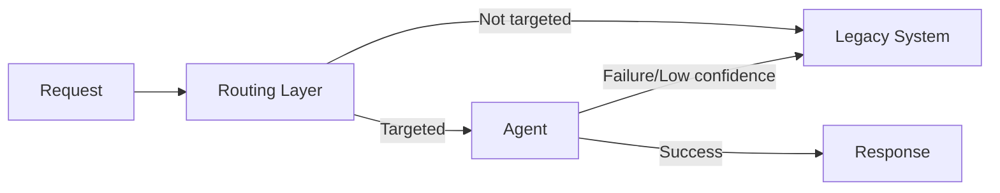

# #48 Strangler Fig

!!! abstract "TL;DR"
    Instead of replacing existing non-AI processing with agents all at once, migrate incrementally through a routing layer.

<!-- BEGIN:GEN:meta -->

Metadata (machine-readable) — #48 Strangler Fig

| Field | Value |
|------|-----|
| **ID** | 48 |
| **Category** | 10-deployment — Deployment, Vendor Abstraction & Migration |
| **Forces** | `[F2]`, `[F8]` |
| **Dials** | — |
| **Tradeoffs** | — |
| **Related Patterns** | #36, #45, #40 |
| **When to Use** | Agent replacement of existing systems (incremental risk management), rule-based → AI gradual migration |
| **When Not to Use** | Greenfield new development; all-or-nothing coupling; categories cannot be split |
| **Element Technologies** | Feature Flag (LaunchDarkly/Unleash), Production Replay comparison, Eval CI/CD, fallback |

<!-- END:GEN:meta -->

## Overview

You replaced a long-running rule-based inquiry handling system with an AI agent all at once, only to see a flood of errors from unexpected cases -- this is a big-bang release failure you want to avoid.

The Strangler Fig pattern places a routing layer in front of the existing system and routes only traffic matching specific conditions to the agent. As success is confirmed, the scope is gradually expanded until the legacy system is finally retired. This is Martin Fowler's Strangler Fig Application pattern adapted for agent adoption.

!!! info "Position in decision-making"
    - **Driving force**: `[F2]` Failure Cost, `[F8]` Accountability & Regulation
    - **Related decision**: Build vs. buy in [Tradeoffs](../../decisions/tradeoffs.md)
    - **Decision flow**: [Decision Flow](../../decisions/decision-flow.md)

## Design

The routing layer determines distribution based on request type, tenant, region, confidence score, etc. Initially, all traffic flows to the existing system while also being sent to the agent in shadow mode for output comparison. Categories meeting quality thresholds are switched to the agent progressively. The existing system is kept as a fallback for agent failures.

## Problems Solved

Agent production quality cannot be fully verified in advance, and wholesale adoption carries the risk of large-scale outages `[F2]`. Incremental migration enables discovering and fixing problems while they are still small. From an auditing perspective, it also provides records of "when and what scope was migrated to agents" `[F8]`.

## When to Use / When Not to Use

- **When to Use**: When there is an existing production system and you want to manage migration risk to agents. When traffic types can be classified and incremental switching conditions can be defined.
- **When Not to Use**: New services with no existing system (nothing to incrementally migrate from). When all requests are tightly coupled, making partial switching difficult.

## Element Technologies

- Routing: Feature Flags (LaunchDarkly, Unleash), API Gateway routing rules
- Shadow testing: Combine with [#35 Production Replay](../07-observability/35-production-replay.md)
- Quality comparison: Auto-compare old and new outputs with [#34 Evaluation CI/CD](../07-observability/34-evaluation-ci-cd.md)
- Fallback: [#40 Fallback & Graceful Degradation](../08-cost-scaling/40-fallback-graceful-degradation.md)

## Tuning (Dials)

- **Migration speed (cautious vs. aggressive)** — Too cautious and migration never completes, inflating dual-operation costs vs. too aggressive expands unverified scope / Deciding factor `[F2]` / Guideline: Confirm 2-4 weeks of stable operation per category before proceeding to the next. → [Tuning Dials](../../decisions/tuning-dials.md)

## Related Patterns

- [#36 Shadow / Canary Deployment](../07-observability/36-shadow-canary-deployment.md) — Incrementally verify quality with shadow and canary deploys
- [#45 Agent Runtime Abstraction](45-agent-runtime-abstraction.md) — Abstraction eases switching between old and new runtimes
- [#40 Fallback & Graceful Degradation](../08-cost-scaling/40-fallback-graceful-degradation.md) — Fall back to existing system on agent failure

## References

- Martin Fowler, "Strangler Fig Application" (2004)
