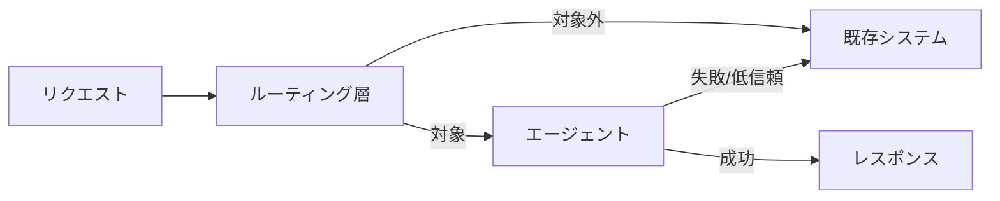

# #48 Strangler Fig｜段階的置換

!!! abstract "一言"
    既存の非AI処理をエージェントで一括置換せず、ルーティング層を介して段階的に移行する。

<!-- BEGIN:GEN:meta -->

メタデータ（機械可読） — #48 Strangler Fig｜段階的置換

| 項目 | 値 |
|------|-----|
| **ID** | 48 |
| **カテゴリ** | 10-deployment — デプロイ・ベンダー抽象化・移行 |
| **フォース** | `[F2]`, `[F8]` |
| **ダイヤル** | — |
| **二者択一** | — |
| **関連パターン** | #36, #45, #40 |
| **向き** | 既存システムのエージェント置換（段階的リスク管理）、ルールベース→AI段階移行 |
| **不向き** | グリーンフィールド新規; 全か無かの結合; カテゴリ分割不可能 |
| **要素技術** | Feature Flag (LaunchDarkly/Unleash), Production Replay比較, Eval CI/CD, フォールバック |

<!-- END:GEN:meta -->

## 概要

長年運用してきたルールベースの問い合わせ対応システムを、AIエージェントに一気に置き換えたら、想定外のケースで大量のエラーが発生した――こうしたビッグバンリリースの失敗は避けたい場面である。

Strangler Fig（絞め殺しの木）パターンでは、既存システムの前段にルーティング層を置き、条件に合うトラフィックだけをエージェントに流す。成功が確認できたら対象を段階的に広げ、最終的に旧システムを退役させていく。マーティン・ファウラーのStrangler Fig Applicationパターンをエージェント導入に適用したものである。

!!! info "意思決定上の位置づけ"
    - **必要にするフォース**: `[F2]` 失敗コスト・`[F8]` 説明責任・規制
    - **関与する決定**: [相反](../../decisions/tradeoffs.md) の ビルド↔バイ
    - **意思決定の進め方**: [意思決定の進め方](../../decisions/decision-flow.md)

## 設計

ルーティング層は、リクエストの種別・テナント・地域・信頼度スコア等に基づいて振り分けを決定する。初期は全トラフィックを既存システムに流しつつ、エージェントにもシャドーで送り、出力を比較する。品質が一定水準を満たしたカテゴリから順にエージェントへ切り替えていく。エージェントが失敗した場合のフォールバック先として、既存システムは残しておく。

## 解決する課題

エージェントの本番品質は事前に完全には検証できず、一括導入は大規模な障害リスクを伴う `[F2]`。段階的に移行すれば、問題が小さいうちに発見・修正できる。また、監査の観点でも「いつ・どの範囲をエージェントに移行したか」の記録が残る `[F8]`。

## 向き / 不向き

- **向き**: 既存の本番システムがあり、エージェントへの移行リスクを管理したいケース。トラフィックの種別が分類可能で、段階的な切り替え条件を定義できる場合。
- **不向き**: 新規サービスで既存システムが存在しない場合（段階移行の対象がない）。全リクエストが強く結合しており、部分的な切り替えが困難な場合。

## 要素技術

- ルーティング: Feature Flag（LaunchDarkly、Unleash）、API Gateway のルーティングルール
- シャドーテスト: [#35 Production Replay](../07-observability/35-production-replay.md) と組み合わせ
- 品質比較: [#34 Evaluation CI/CD](../07-observability/34-evaluation-ci-cd.md) で新旧出力を自動比較
- フォールバック: [#40 Fallback & Graceful Degradation](../08-cost-scaling/40-fallback-graceful-degradation.md)

## 調整（程度）

- **移行速度（慎重 ↔ 積極的）** — 慎重すぎると移行が完了せず二重運用コストが膨張 ⇔ 積極的すぎると品質未検証の範囲が拡大 / 決め手 `[F2]` / 目安: カテゴリ単位で2〜4週間の安定稼働を確認してから次へ。→ [程度ダイヤル](../../decisions/tuning-dials.md)

## 関連パターン

- [#36 Shadow / Canary Deployment](../07-observability/36-shadow-canary-deployment.md) — シャドー・カナリアデプロイで品質を段階検証
- [#45 Agent Runtime Abstraction](45-agent-runtime-abstraction.md) — 抽象化により新旧ランタイムの切り替えを容易にする
- [#40 Fallback & Graceful Degradation](../08-cost-scaling/40-fallback-graceful-degradation.md) — エージェント失敗時に既存システムへフォールバック

## 参考

- Martin Fowler, "Strangler Fig Application" (2004)
