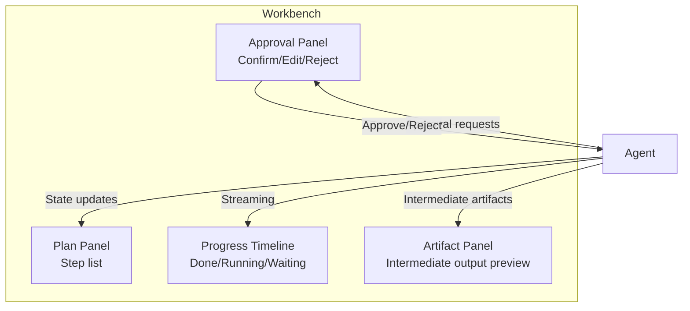

# #49 Agent Workbench

!!! abstract "TL;DR"
    Provide a dashboard-style UI that manages the agent's plan, progress, intermediate artifacts, and approvals in a single screen.

<!-- BEGIN:GEN:meta -->

Metadata (machine-readable) — #49 Agent Workbench

| Field | Value |
|------|-----|
| **ID** | 49 |
| **Category** | 11-ux — UI/UX & Human Collaboration |
| **Forces** | `[F4]` |
| **Dials** | — |
| **Tradeoffs** | — |
| **Related Patterns** | #50, #51, #7, #31 |
| **When to Use** | Multi-step tasks over 5 minutes (research, code, analysis), workflows requiring mid-stream approval |
| **When Not to Use** | Single Q&A; tasks completing in seconds; chat-only is sufficient |
| **Element Technologies** | React/Next.js, SSE/WebSocket, plan/progress/artifact/approval panels |

<!-- END:GEN:meta -->

## Overview

When you assign a 30-minute research task to an agent, simply watching messages scroll in a chat window leaves you unable to tell "what it's doing now" or "when it needs my judgment." Chat UI alone cannot manage long-running agent tasks.

Agent Workbench provides an operational screen that integrates a plan view, progress timeline, artifact panel, and approval buttons alongside chat. Users can see the overall plan, progress of each step, previews of intermediate artifacts, and operations awaiting approval -- all in one screen, enabling timely intervention.

!!! info "Position in decision-making"
    - **Driving force**: `[F4]` Latency Budget
    - **Decision flow**: [Decision Flow](../../decisions/decision-flow.md)

## Design

The agent emits events for each step's state changes, intermediate artifacts, and approval requests. The Workbench receives these in real-time and reflects them in each panel. Users can review past steps from the timeline or intervene through the approval panel.

## Problems Solved

When agent tasks span minutes to tens of minutes, chat UI makes progress tracking difficult `[F4]`. When information like "how far along," "what comes next," and "where approval is needed" is scattered, users' cognitive load increases, ultimately reducing trust in the agent. The Workbench structures and displays this information, ensuring transparency for long-running tasks.

## When to Use / When Not to Use

- **When to Use**: Multi-step tasks taking several minutes or more such as research, code generation, and data analysis. Workflows requiring mid-stream approval or course correction.
- **When Not to Use**: Single Q&A or simple tasks completing in seconds -- overkill for interactions where chat UI is sufficient.

## Element Technologies

- Frontend: React / Next.js + real-time updates (SSE / WebSocket)
- State management: Subscribe to agent event streams and reflect in UI state
- Plan display: Combine with [#50 Editable Plan](50-editable-plan.md) for editability
- Approval UI: Frontend implementation of [#31 Human Approval Checkpoint](../06-reliability/31-human-approval-checkpoint.md)

## Related Patterns

- [#50 Editable Plan](50-editable-plan.md) — Make the plan panel editable
- [#51 Agent-to-Human Escalation](51-agent-to-human-escalation.md) — Receive escalations in the approval panel
- [#7 Streaming Progress](../01-execution/07-streaming-progress.md) — Progress streaming serves as the Workbench's data source

## References

- Devin, OpenAI Canvas, Cursor Composer, and other agent-style UI examples
