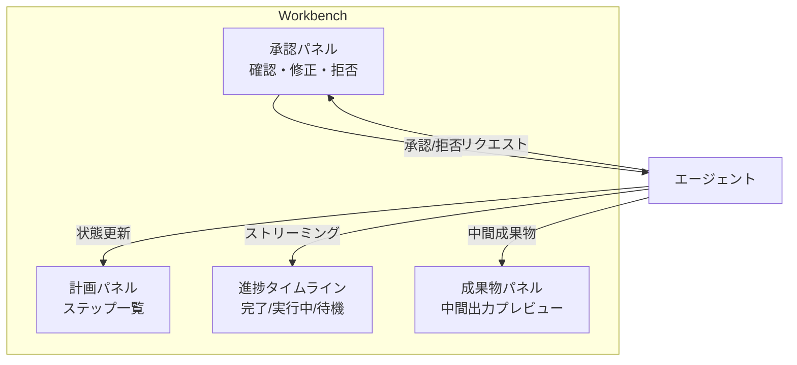

# #49 Agent Workbench｜エージェントワークベンチ

!!! abstract "一言"
    エージェントの計画・進捗・中間成果物・承認を一画面で管理するダッシュボード型UIを提供する。

## 概要

チャットUIだけではエージェントの長時間タスクを管理しきれない。計画の全体像、各ステップの進捗、中間成果物のプレビュー、承認待ちの操作が一つの流れの中で把握できないと、ユーザーは「何をしているか分からない」不安から介入タイミングを逃す。Agent Workbenchは、チャットに加えて計画ビュー・進捗タイムライン・成果物パネル・承認ボタンを統合した操作画面を提供する。

!!! info "意思決定上の位置づけ"
    - **必要にするフォース**: `[F4]` レイテンシ予算
    - **意思決定の進め方**: [意思決定の進め方](../../decisions/decision-flow.md)

## 設計

エージェントは各ステップの状態変更・中間成果物・承認リクエストをイベントとして発行する。Workbenchはこれらをリアルタイムで受信し、各パネルに反映する。ユーザーはタイムラインから過去のステップを確認でき、承認パネルから介入できる。

## 解決する課題

エージェントのタスクが数分〜数十分に及ぶ場合、チャットUIでは進捗の把握が困難になる `[F4]`。「どこまで進んだか」「次に何をするか」「どこで承認を求めているか」が分散すると、ユーザーの認知負荷が上がり、結果的にエージェントへの信頼が低下する。Workbenchはこれらを構造化して表示することで、長時間タスクの透明性を確保する。

## 向き / 不向き

- **向き**: リサーチ・コード生成・データ分析など、多段階で数分以上かかるタスク。途中承認や方向修正が必要なワークフロー。
- **不向き**: 単発のQ&Aや数秒で完了する簡易タスク。チャットUIで十分なインタラクション。

## 要素技術

- フロントエンド: React / Next.js + リアルタイム更新（SSE / WebSocket）
- 状態管理: エージェントのイベントストリームを購読し、UIステートに反映
- 計画表示: [#50 Editable Plan](50-editable-plan.md) と組み合わせて編集可能に
- 承認UI: [#31 Human Approval Checkpoint](../06-reliability/31-human-approval-checkpoint.md) のフロントエンド実装

## 関連パターン

- [#50 Editable Plan](50-editable-plan.md) — 計画パネルを編集可能にする
- [#51 Agent-to-Human Escalation](51-agent-to-human-escalation.md) — 承認パネルでエスカレーションを受ける
- [#7 Streaming Progress](../01-execution/07-streaming-progress.md) — 進捗ストリーミングがWorkbenchのデータソースになる

## 参考

- Devin、OpenAI Canvas、Cursor Composer など、エージェント型UI先行事例
